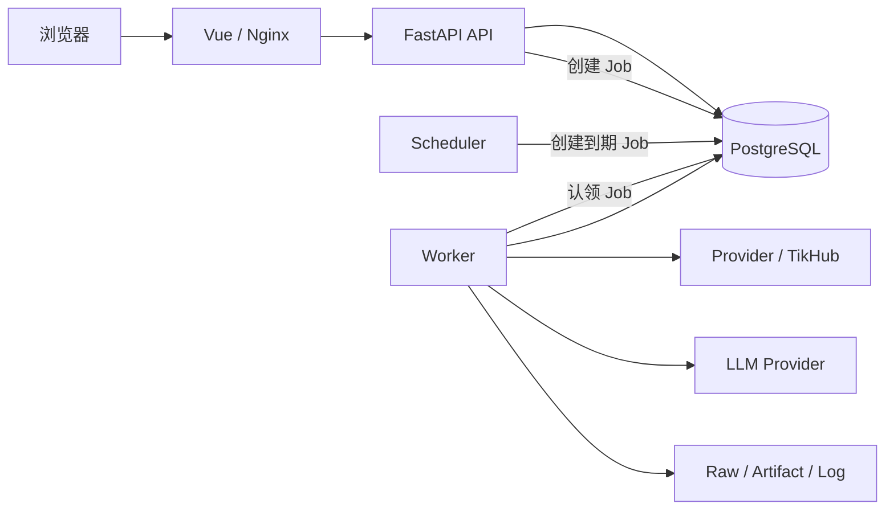

# 总体架构与技术选型

这篇文档先回答三个问题：

1. AIMA_UGC 到底要解决什么问题？
2. 为什么当前不拆微服务，而是用一个模块化单体？
3. 一条外部舆情数据从进入系统到页面可见，中间经过哪些稳定边界？

具体 SQL、TikHub 响应、Scheduler 恢复、Excel/AI/报告实现不在这里展开，见 [`../appendix/README.md`](../appendix/README.md)。

## 1. 系统要解决的问题

AIMA_UGC 是一个多来源舆情数据系统。当前已经具备：

- TikHub 五平台采集：小红书、抖音、微博、B站、快手；
- Excel 手工导入；
- Provider Raw/来源追溯；
- Canonical 统一数据；
- PostgreSQL Current/Version/Metric 历史；
- 持久化 Job 与 Scheduler；
- 相关性过滤；
- AI 相关性、发声类型、情感、一级/二级标签；
- 声音广场等业务查询页面；
- 正式 Excel Export；
- 离线 Markdown/Word 舆情报告。

系统最重要的长期要求不是“支持尽可能多的技术”，而是：

```text
第三方接口变化
→ 尽量只改 Provider / Mapper

业务字段变化
→ 能明确找到 Canonical / Owner / Migration / API 的修改位置

耗时任务
→ 服务重启后仍能恢复

任何一条业务数据
→ 能追溯来源和历史

页面变化
→ 不反向污染数据库和 Provider
```

## 2. 为什么选择模块化单体

“模块化单体”可以白话理解成：

> 代码在一个仓库、共享一个 PostgreSQL，但不同业务模块有明确 Owner 和调用边界。

当前规模下，主要复杂度来自：

- 外部 Provider 不稳定；
- 批量任务耗时；
- 数据需要去重、版本化和追溯；
- AI/导出需要异步运行；
- 前端和后端会持续迭代。

这些问题并不会因为拆成十几个微服务自动消失。相反，微服务会额外引入网络调用、分布式事务、服务发现和部署复杂度。

所以当前采用：

```text
一个后端代码库
+ 清晰模块边界
+ API / Worker / Scheduler / Migration 分进程
+ 一个 PostgreSQL 业务事实库
```

只有出现真实扩展证据时，才评估 Redis、Kafka、OpenSearch、Kubernetes 或拆服务；不会为了“架构看起来高级”提前引入。

## 3. 一条数据的主流程

### 3.1 外部采集

```text
Provider Adapter / Operation
→ 不可变 Raw Artifact
→ Candidate
→ Mapper
→ Canonical
→ Relevance
→ Ingestion Service
→ Content Owner Repository
→ PostgreSQL
```

### 3.2 Excel 导入

Excel 没有真实 Collection Run/Scope，所以来源父级不同：

```text
Input Artifact
→ Processing Import Batch
→ Provider Request / Attempt
→ Reader / Mapper
→ Canonical
→ Relevance
→ 同一个 Ingestion / Content Owner
→ PostgreSQL
```

两条链在 Canonical/Ingestion 后共享业务去重、版本和指标规则，但不会伪造相同的来源父级。

### 3.3 读取与页面

```text
PostgreSQL
→ Query Repository / Read Model
→ Query/Application Service
→ FastAPI Router
→ OpenAPI Generated Client
→ Vue Feature / Page
```

页面不直接理解数据库表，Repository 也不理解 Vue。

## 4. 为什么要有 Raw、Canonical、Ingestion 三层

### Raw：保留“对方当时实际给了什么”

如果 TikHub 字段映射写错，可以重新从 Raw 回放；不能为了重新解析又付费请求一次 Provider。

### Canonical：统一“系统内部怎么描述一条内容”

TikHub、官方 API、Apify、文件导入各自字段不同，但进入业务系统后需要统一语言。

### Ingestion：统一“这条数据怎么进数据库”

这里处理：

- 稳定身份去重；
- Current 更新；
- Version；
- Metric Observation；
- 来源关系；
- Owner 写入边界。

所以 Provider 不能直接 `INSERT contents`，Mapper 也不能通过查数据库自行决定去重。

## 5. 当前运行组件



### API

负责短请求：校验、查询、短事务、创建 Job、读取结果。

不在 Router 里：

- 写 SQL；
- 跑长时间采集；
- 批量调用模型；
- 直接解析 Provider Raw。

### Worker

执行持久化 Job，例如：

- Collection；
- Excel Import；
- AI Analysis；
- Excel Export；
- 后续报告/清理等长任务。

### Scheduler

只判断 Plan 什么时候到期，并创建 Occurrence/Run/Job；不直接发 Provider 请求。

### Migration

所有正式数据库结构变化通过 Alembic Revision 演进。API 启动不能偷偷建表或改表。

## 6. 当前业务模块

当前 `backend/src/aima_ugc/modules/` 实际存在：

| 模块 | 白话职责 |
| --- | --- |
| `system` | 系统设置、Provider 配置、关键词/相关性配置、审计等共享业务事实 |
| `collection` | Plan、Occurrence、Run、Scope、Provider Request/Attempt、Candidate 和采集执行 |
| `content` | 账号、内容、评论、Current/Version/Metric、查询与正式写 Owner |
| `ingestion` | Excel File Import 的 Processing Import Batch 等统一导入父事实 |
| `analysis` | AI 请求、分析结果、发声类型、情感和标签 |
| `reporting` | 正式 Excel Export 的持久化业务事实 |

`platform/` 放 Job、Artifact、日志、数据库运行时等跨业务基础设施，不是一个“万能业务模块”。

当前**没有**正式 `monitoring` 或 `dashboard` 后端模块。Stage 9 Analysis and Monitoring 是下一阶段方向，未实现能力不得因为蓝图规划被写成当前代码事实。

## 7. 当前前端结构

当前 `frontend/src/` 已有正式业务页面/Feature，不是只剩 health smoke：

```text
app/
pages/
features/
  analysis/
  export/
  import-excel/
  jobs/
  keyword-planning/
  overview/
  providers/
  runs/
  settings/
  voice-plaza/
shared/
generated/api/
```

依赖方向：

```text
Page
→ Feature Store / Feature API
→ generated/api
→ HTTP API
```

`generated/api/` 来自 OpenAPI，禁止手工修改。

Figma/Design-to-Code 的开发方法见 [`../guides/前端与Figma工作流.md`](../guides/前端与Figma工作流.md)。

## 8. 技术基线

当前长期技术路线：

| 领域 | 选择 |
| --- | --- |
| 后端语言 | Python 3.14 |
| API | FastAPI + Pydantic 2 |
| 数据库访问 | SQLAlchemy 2 + psycopg 3 |
| Migration | Alembic |
| Python 工程 | 仓库根 `pyproject.toml + uv.lock` |
| 数据库 | PostgreSQL 18 |
| Job | PostgreSQL 持久化 Job |
| 前端 | Vue 3 + TypeScript + Vite + Pinia |
| API Client | OpenAPI → Orval 生成 TypeScript Client |
| 文件 | Local ArtifactStore 默认，可替换 S3 |
| 日志 | 应用 `.log` 为主要排障日志 |
| 部署方向 | Docker Compose 离线 Release |

精确 patch/包版本不在蓝图复制，以下文件才是当前版本事实：

```text
.python-version
.node-version
.uv-version
pyproject.toml
uv.lock
frontend/package.json
frontend/package-lock.json
Dockerfile / Release Manifest（对应能力建立后）
```

发现上游新版本不会自动升级；升级是独立任务。

## 9. 为什么后端当前以同步调用为主

当前 SQLAlchemy Session 和主要 Provider 调用链以同步模型为主。原因很实际：

- Worker 本来就是独立进程；
- 事务边界更直观；
- 调试和测试更容易理解；
- 不在项目里混用多套同步/异步数据库模式。

如果以后测量证明 Provider 批量 HTTP 并发是瓶颈，可以在明确边界内增加受控并发，不需要为了一个性能点把整个系统改成异步。

## 10. 可替换边界

当前真正值得隔离的变化：

- TikHub / 官方 API / Apify / 自建采集器 / 文件导入；
- LLM Provider；
- Local ArtifactStore / S3；
- 未来企业身份 Provider；
- 报告 Renderer。

不做没有真实需求的“所有东西都可插拔”。例如当前只支持 PostgreSQL，不额外维护 MySQL/SQLite 兼容层。

## 11. 认证、预算、Release 的当前边界

### 认证

第一版登录/企业身份接入仍明确延期。当前业务 API/页面已经存在，但不能因此宣称具备公网生产认证能力。

### Provider/AI 预算

系统保存请求/Token/成本审计事实，但当前没有请求次数或金额 Budget Guard。

### Release/协调备份

长期方向仍是 Docker Compose 离线 Release + 数据库/Artifact 一致性 Backup Set。未完成的 Release 写屏障、备份恢复能力不能写成已实现。

## 12. 代码目录怎么找

```text
仓库根/
├─ AGENTS.md                 开发统一规则
├─ backend/src/aima_ugc/
│  ├─ entrypoints/           API / Worker / Scheduler / Migration 进程入口
│  ├─ bootstrap/             生产装配
│  ├─ modules/               业务 Owner
│  ├─ platform/              Job / Artifact / DB / Logging 等基础设施
│  ├─ adapters/              Provider / Persistence 等外部实现
│  └─ contracts/             手写 Pydantic 业务契约
├─ frontend/src/             Vue 前端
├─ migrations/versions/      Alembic Schema 历史
├─ contracts/                生成 OpenAPI / JSON Schema
├─ tests/                    自动化验证
├─ docs/blueprint/           长期架构
├─ docs/appendix/            专题细节/排障
├─ docs/guides/              开发工作流
└─ changes/                  变更原因与历史
```

## 13. 继续阅读

- 数据怎么统一：[`02-采集系统与数据标准化.md`](02-采集系统与数据标准化.md)
- 数据怎么存：[`03-数据库与文件存储.md`](03-数据库与文件存储.md)
- API/Job/前端怎么协作：[`04-后端任务API与前端.md`](04-后端任务API与前端.md)
- 日志/安全/部署：[`05-日志安全部署与运维.md`](05-日志安全部署与运维.md)
- 怎么开发和验收：[`06-开发约束与分阶段实施.md`](06-开发约束与分阶段实施.md)
- 已确认决策：[`07-技术决策与实施门禁.md`](07-技术决策与实施门禁.md)
- 采集策略：[`08-采集策略与平台能力.md`](08-采集策略与平台能力.md)
