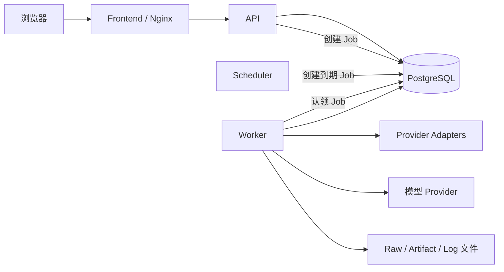

# 总体架构与技术选型

## 1. 目标

新系统必须同时满足：

1. 支持小红书、抖音、微博、B站、快手等来源；
2. 第三方接口变化时，尽量只修改对应 Provider 和 Mapper；
3. 前端、API、Worker、Scheduler、数据库可以单独开发和验证；
4. 采集、AI、报告等耗时任务不占用 HTTP 请求；
5. 数据可追溯，能够回答“哪次请求、哪个关键词、哪个原始响应产生了这条数据”；
6. 服务重启、任务重试和发布升级不丢失业务状态；
7. 单台服务器可稳定运行，同时为以后替换对象存储、模型和认证方式保留真实边界；
8. 基础一般的新开发人员能通过文档和测试定位修改入口。

## 2. 第一性原理

### 2.1 模块存在的理由是隔离变化

不是目录越多越好。只有当一部分代码有独立变化原因、明确输入输出或独立验证价值时，才成为模块。

例如：

```text
某个 Provider 改了分页字段
→ 应主要影响对应 Provider Adapter / Operation 和 Fixture

新增一个内容业务字段
→ 应影响 Canonical、Mapper、数据库和 API

页面颜色变化
→ 不应修改后端和数据库
```

### 2.2 先稳定业务语言，再连接第三方

TikHub、官方 API、Apify 等 Provider 以及小红书、抖音、微博、B站、快手的平台私有字段都不是系统公共语言。系统先定义版本化的理想 Canonical Contract，再让各 Provider/平台 Mapper 适配。

```text
Provider Adapter
→ 不可变 Raw Evidence
→ Mapper
→ Canonical Content / Comment
→ Ingestion Service
→ Owner Repository
→ PostgreSQL

PostgreSQL
→ Query Repository / Read Model
→ Query/Application Service
→ API / AI / Reporting
```

Canonical 之后不再关心数据来自 TikHub、官方 API、Apify、自建采集器还是文件导入；数据库读写也不反向污染 Mapper。

### 2.3 当前规模优先简单可靠

公开舆情系统的大部分耗时来自外部接口、批量处理和数据库写入。把 API、Worker、Scheduler 分进程已经能隔离主要风险，不需要先拆微服务。

### 2.4 可替换不等于所有东西都做兼容层

真正值得替换的边界：

- TikHub、官方 API、Apify、自建采集器、文件/历史导入等数据 Provider Adapter；
- 本地文件存储或 S3；
- DeepSeek/OpenAI-compatible 等模型；
- 本地账号或企业登录；
- 报告渲染器。

不值得在第一版做的“通用兼容”：

- 同时支持 PostgreSQL、MySQL、SQLite；
- 同时支持 Vue、React；
- 同时支持 Redis、RabbitMQ、Kafka；
- 运行时任意加载插件。

数据库和前端框架一旦选定，就通过清晰代码和数据迁移维护，而不是制造最低公分母接口。

## 3. 技术基线

本蓝图采用**方案 A**：仓库根目录是唯一 Python/uv 工程根，根目录保存 `pyproject.toml`、`uv.lock`、`tests/` 和 `scripts/`；后端可导入源码固定放在 `backend/src/aima_ugc/`。所有后端命令从仓库根执行，不再存在第二套 `backend/pyproject.toml`、`backend/uv.lock` 或 `backend/tests/`。

技术名称和大版本由本章确定，编制日精确兼容快照由 [07-技术决策与实施门禁.md](07-技术决策与实施门禁.md) 冻结：运行时/基础设施选官方 Stable/LTS，语言包选 Registry 最新非预发布且满足兼容约束的版本。初始化时按该表生成锁文件；锁文件和 Release Manifest 一旦产生就是运行事实。发现新版本不会触发自动升级，升级只能作为单独任务评估兼容性、Migration、回滚和完整验证。

### 3.1 后端

| 项目 | 基线 |
| --- | --- |
| Python | 3.14 系列，开发与 CI 使用 `.python-version` 固定精确 patch，`pyproject.toml` 声明 `>=3.14,<3.15` |
| Web | FastAPI 编制日 Registry 最新非预发布版（PyPI classifier 仍为 Beta），初始化时锁定精确版本 |
| 数据验证 | Pydantic 2 |
| 数据库访问 | SQLAlchemy 2.0 风格 |
| PostgreSQL 驱动 | psycopg 3 |
| Migration | Alembic |
| HTTP Client | httpx |
| 依赖管理 | uv + `pyproject.toml` + `uv.lock` |
| 格式和静态检查 | Ruff |
| 类型检查 | mypy，不使用 SQLAlchemy 旧 Mypy Plugin |
| 测试 | pytest |

默认使用同步 SQLAlchemy Session 和同步 Provider Client。原因是：

- Worker 本来就是独立进程；
- 采集并发可以由多个 Worker 或受控线程实现；
- 同步调用链更容易理解、调试和测试；
- 避免在基础一般的团队中混用同步和异步数据库事务。

如果未来有证据表明单进程大量并发 HTTP 是瓶颈，可以只在 Provider 批量请求层引入受控异步实现，不要求全项目改成异步。

### 3.2 前端

| 项目 | 基线 |
| --- | --- |
| Node.js | 24 LTS，开发、CI 和镜像固定精确 patch |
| 框架 | Vue 3 |
| 语言 | TypeScript |
| 构建 | Vite 8 编制日 Registry 最新非预发布兼容版，锁文件固定精确版本 |
| 路由 | Vue Router |
| 状态 | Pinia |
| UI | Element Plus，可替换但不自研基础控件库 |
| 图表 | ECharts |
| 单元测试 | Vitest + Vue Test Utils |
| E2E | Playwright |
| 包管理 | npm + `package-lock.json` |

必须使用 TypeScript。业务 API、Store、页面参数和表格字段不能长期依赖无类型 `any`。

### 3.3 数据与运行

| 项目 | 基线 |
| --- | --- |
| 数据库 | PostgreSQL 18 当前稳定小版本，Release 固定镜像 digest |
| 任务队列 | PostgreSQL Job 表 |
| Raw/Artifact | 本地文件系统默认实现 |
| 反向代理 | Nginx |
| 容器 | Docker Engine + 现代 `docker compose` 插件；Release Manifest 声明并验证最低兼容版本 |
| 部署 | CI 构建离线 Release，服务器只导入并运行 |
| 时区 | 数据库存 UTC；业务调度和日志显示 Asia/Shanghai |

## 4. 运行组件



### 4.1 API

负责：

- 第三方身份接入后，通过统一 `Principal/AuthContext` 执行后端权限校验；当前第一版不实现登录入口；
- 参数校验；
- 短查询；
- 短数据库事务；
- 创建 Job；
- 查询 Job、Run 和业务结果；
- 下载已生成的 Artifact。

禁止：

- 在请求中执行长时间采集；
- 在请求中批量调用模型；
- 在 Router 中写 SQL；
- 直接操作任一 Provider 原始响应；
- 启动时自动创建或修改数据库表。

### 4.2 Worker

负责：

- 执行采集、详情、评论、AI、报告和导出 Job；
- 定期续租；
- 上报进度；
- 处理取消；
- 分类重试；
- 写入 Raw、Artifact 和业务数据。

Worker 不提供 HTTP 路由。

### 4.3 Scheduler

负责读取计划和创建到期 Job。Scheduler 不直接调用任何数据 Provider，不直接运行 AI，不直接写内容表。

### 4.4 Migration

生产发布增加一次性 `migrate` 服务：

```text
暂停调度与高风险写入
→ 创建协调数据库+Artifact Backup Set
→ migrate 执行 Alembic upgrade
→ 校验 Schema
→ 启动 API/Worker/Scheduler
```

Migration 不放到 API 启动命令里，避免多个 API 副本同时升级数据库，也避免服务启动失败时无法区分 Migration 错误和应用错误。

## 5. 业务模块

目标后端只保留七个业务模块。

| 模块 | 负责什么 | 主要输出 |
| --- | --- | --- |
| `system` | System Settings、关键词包、Provider 非敏感配置、Provider 中立审计；未来第三方身份通过 Adapter → Principal/AuthContext → Permission 扩展 | 配置、审计和未来授权边界 |
| `collection` | 采集计划、Run、Scope、Provider Adapter 调用、Raw、Candidate、Mapper、重试 | Canonical 内容和评论 |
| `content` | Ingestion、内容、评论、版本、指标历史、Owner Repository、Query Repository/Read Model、人工复核 | 稳定业务数据与内容聚合视图 |
| `analysis` | AI 标签、摘要、分类、模型运行记录 | 版本化分析结果 |
| `monitoring` | 规则、风险事件、告警、VOC 和工单 | 可跟踪的处置状态 |
| `reporting` | 报告上下文、渲染、导出和 Artifact | 可下载文件 |
| `dashboard` | 面向页面的聚合查询 | 只读 View Model |

`dashboard` 只做只读聚合，不拥有业务写入。电商抓取不属于核心舆情系统，后续确有需求时作为独立扩展模块加入。

## 6. 代码目录

```text
仓库根目录/
├─ AGENTS.md
├─ README.md
├─ pyproject.toml
├─ uv.lock
├─ .python-version
├─ .node-version
├─ Dockerfile
├─ .agents/
│  └─ skills/reliable-vibe-coding/
├─ backend/
│  ├─ src/aima_ugc/
│  │  ├─ entrypoints/
│  │  │  ├─ api_main.py
│  │  │  ├─ worker_main.py
│  │  │  ├─ scheduler_main.py
│  │  │  └─ migrate_main.py
│  │  ├─ bootstrap/
│  │  │  ├─ api.py
│  │  │  ├─ worker.py
│  │  │  └─ scheduler.py
│  │  ├─ platform/
│  │  │  ├─ config/
│  │  │  ├─ database/
│  │  │  ├─ jobs/
│  │  │  ├─ logging/
│  │  │  ├─ storage/
│  │  │  ├─ security/
│  │  │  └─ http/
│  │  ├─ modules/
│  │  │  ├─ system/
│  │  │  ├─ collection/
│  │  │  ├─ content/
│  │  │  ├─ analysis/
│  │  │  ├─ monitoring/
│  │  │  ├─ reporting/
│  │  │  └─ dashboard/
│  │  └─ adapters/
│  │     ├─ providers/
│  │     │  ├─ tikhub/
│  │     │  ├─ official/
│  │     │  ├─ apify/
│  │     │  └─ imports/
│  │     ├─ llm/
│  │     ├─ persistence/postgres/
│  │     ├─ storage/local/
│  │     └─ auth/
├─ migrations/
├─ tests/
│  ├─ unit/
│  ├─ contracts/
│  ├─ integration/
│  ├─ api/
│  ├─ architecture/
│  ├─ fixtures/
│  └─ probes/
├─ scripts/
│  ├─ contracts/
│  └─ quality/
├─ contracts/
│  ├─ openapi/
│  └─ canonical/
├─ frontend/
├─ docs/
│  └─ blueprint/
├─ compose.yaml
├─ compose.local.yaml
├─ compose.production.yaml
├─ env.local.example
└─ env.production.example
```

`backend/` 只是 Python 源码目录和后端镜像的源码输入，不是独立 uv 子项目。唯一 `Dockerfile`、`pyproject.toml` 和 Lock 都在根目录，因此 Docker build context 固定为仓库根；不得把 `backend/` 单独作为 build context。`frontend/` 是独立 npm 项目。

阶段 1 必须在根 `pyproject.toml` 明确选择并锁定一个支持 Python 3.14 的 build backend，以及指向 `backend/src` 的 package discovery；应用按可安装 package 运行。选择前比较维护状态、许可证、uv/Editable/Wheel 支持和 `linux/amd64` 构建结果，记录到决策文档。不得依赖临时 `PYTHONPATH`、修改当前工作目录或测试内 `sys.path` 才能导入；`uv sync --locked` 后必须能直接执行 `uv run python -c "import aima_ugc"`，并实际构建/安装 Wheel 验证包内容。

前端：

```text
frontend/
├─ package.json
├─ package-lock.json
├─ src/
│  ├─ app/
│  ├─ generated/api/
│  ├─ features/
│  │  ├─ overview/
│  │  ├─ data-sources/
│  │  ├─ collection/
│  │  ├─ content/
│  │  ├─ comments/
│  │  ├─ monitoring/
│  │  ├─ analysis/
│  │  ├─ reports/
│  │  └─ system/
│  └─ shared/
└─ tests/
```

## 7. 模块内部最小结构

一个业务模块通常只需要：

```text
modules/content/
├─ api.py          HTTP 入口
├─ schemas.py      HTTP 请求和响应
├─ models.py       模块内部业务对象
├─ service.py      业务用例
├─ ports.py        仅放确实需要替换或 Fake 的边界
├─ jobs.py         本模块 Job Payload 和 Handler
├─ queries.py      只读查询入口
└─ README.md       输入、输出、修改入口和验证命令
```

不是每个模块都必须有全部文件。没有 Job 就不创建 `jobs.py`；没有外部依赖就不创建 `ports.py`。

## 8. 依赖方向

允许：

```text
api.py
→ service.py
→ models.py / ports.py
→ adapter / repository
```

跨模块：

```text
一个模块的 Service
→ 另一个模块公开的 Service 或 Query 接口
```

禁止：

- Router 直接 SQL；
- Provider 直接 Repository；
- Mapper 直接调用前端 DTO；
- 一个模块导入另一个模块的私有 Repository；
- 多个 Repository 写同一张表；
- `platform/` 依赖具体业务模块；
- 前端 Feature 直接导入另一个 Feature 的私有 Store；
- 为了方便复制一套 API、SQL、Provider Client 或 Mapper。

## 9. 真正的可替换边界

| 能力 | 业务看到的接口 | 默认实现 | 可替换实现 |
| --- | --- | --- | --- |
| UGC Provider | `ContentProvider` | TikHub（首个参考实现） | 官方 API、Apify、自建采集器、文件/历史导入 |
| Raw/Artifact | `ArtifactService` + `ArtifactStore` | Local File Store | S3、MinIO、OSS |
| 模型 | `LLMProvider` | OpenAI-compatible | DeepSeek、OpenAI、本地模型 |
| 认证 | `Identity/Auth Adapter` | 当前未实现，登录已延期 | 飞书、OIDC、其他企业身份源 |
| 报告渲染 | `ReportRenderer` | HTML/DOCX/XLSX | 其他模板或服务 |

接口必须以系统自己的输入输出定义，不能暴露第三方 SDK 对象。`ArtifactService` 负责 Artifact ID、数据库元数据、权限和生命周期；只负责字节存取的 `ArtifactStore` 使用 `storage_key`，不得反向查询数据库。

## 10. 什么时候才升级架构

只有出现以下证据才评估新组件：

| 证据 | 先做什么 | 仍无法解决时 |
| --- | --- | --- |
| Job 表认领和更新持续造成数据库明显争用 | 修索引、缩短事务、批量认领、增加 Worker | 评估专用消息队列 |
| Raw/Artifact 占满单机磁盘或需跨机器共享 | 清理策略、独立数据盘、备份 | 切换 S3/MinIO Adapter |
| 中文搜索在阶段 0 基准和合理索引后仍达不到目标 | 用真实中文语料比较 PostgreSQL 全文检索、`pg_trgm` 和经批准的分词方案 | 评估 OpenSearch |
| 单体发布持续阻塞多个独立团队 | 先收紧模块和 Owner | 只拆有独立发布和容量需求的模块 |
| 单服务器不可满足恢复时间或容量 | 备份恢复演练、只读副本 | 评估高可用 PostgreSQL 和多节点部署 |

## 11. 必须保留的简单性

- 一个功能只有一个正式实现入口；
- 调试入口调用生产实现，不复制业务逻辑；
- 默认一个数据库；
- 默认只构建一个后端运行镜像，API、Worker、Scheduler 和 Migration 通过不同启动命令复用它；
- 配置显式传入，不让底层代码猜；
- 时间、身份、状态和错误语义有统一规则；
- 每次设计变化都能用测试证明。
