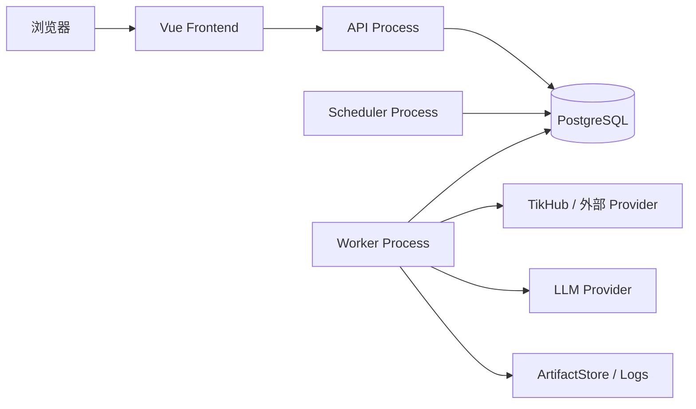

# 总体架构与技术选型

本文解释 AIMA_UGC **当前为什么这样拆、代码实际放在哪里、不同类型变化应该落到哪一层**。

如果你准备直接修改代码，建议同时打开：

- [`../01_代码结构与修改导航.md`](../01_代码结构与修改导航.md)
- 根目录 [`../../AGENTS.md`](../../AGENTS.md)

本文不维护完整数据库字段、OpenAPI 字段或 TikHub 私有 JSON；这些精确事实直接导航到代码、Contract、Migration 和 Fixture。

---

## 1. 系统要解决的实际问题

AIMA_UGC 当前要同时处理：

1. 小红书、抖音、微博、B站、快手等来源；
2. Excel 文件导入；
3. 第三方接口经常变化；
4. 同一内容可能被不同关键词、不同批次、不同来源重复观察；
5. 点赞、评论、播放等指标会不断变化；
6. 采集、AI、导出等任务耗时，不能绑死在 HTTP 请求上；
7. 出错后必须知道“哪次请求、哪个 Raw、哪个 Job、哪个来源产生了这条数据”；
8. 基础一般的开发者也要能快速定位修改入口。

因此当前架构的核心不是“用了多少框架”，而是把变化隔离开。

---

## 2. 第一性原理：模块为什么存在

### 2.1 模块的目的不是分目录，而是隔离变化

只有当一块代码有独立变化原因、明确输入输出、独立失败边界或独立验证价值时，才值得成为模块。

例如：

```text
TikHub 抖音 Search endpoint 变了
→ 主要改 Douyin Operation / Fixture

TikHub 返回字段位置变了
→ 改对应 Mapper / Fixture / Mapper Test

系统新增一个长期公共内容字段
→ 可能影响 Canonical、Content、Migration、API、前端

页面布局变化
→ 不应该修改 Content 表或 Provider Mapper
```

这也是为什么 Provider、Mapper、Canonical、Ingestion 和 Repository 要分开。

### 2.2 第三方格式不是系统公共语言

TikHub、小红书、抖音等外部系统的 JSON 结构可以变化，但系统内部不能跟着每个平台一起变。

当前主链：

```text
Provider / File Reader
→ Raw / Input Artifact
→ Extractor / Mapper
→ CanonicalContentV1 / CanonicalCommentV1
→ Relevance
→ ContentIngestionService
→ Owner Repository
→ PostgreSQL
```

其中：

- **Raw / Input Artifact**：保存外部证据或原始输入；
- **Mapper**：把 Provider 私有字段翻译成系统统一字段；
- **Canonical**：系统统一业务语言；
- **Ingestion**：负责业务身份收敛、Current、Version、Metric 等写入规则；
- **Owner Repository**：只有表 Owner 可以写对应业务表。

精确 Canonical：

```text
backend/src/aima_ugc/contracts/canonical.py
contracts/canonical/
```

TikHub Operation / Mapper：

```text
backend/src/aima_ugc/adapters/providers/tikhub/operations/
backend/src/aima_ugc/adapters/providers/tikhub/mappers/
```

### 2.3 当前规模优先模块化单体

当前系统使用**模块化单体**：业务模块在同一个代码仓库和应用体系中，但通过 Owner、Service、Contract 和 Repository 边界隔离。

为什么当前不拆微服务：

- 主要延迟来自 Provider HTTP、批量 AI 和数据库写入，不是 Python 模块之间函数调用；
- API、Worker、Scheduler 已经分进程，可以隔离主要运行风险；
- 单体内事务能可靠保证 Job + 业务父事实一起提交；
- 团队维护成本更低，调试链更短。

没有真实瓶颈证据时，不引入 Redis、Kafka、RabbitMQ、MongoDB、OpenSearch、Kubernetes 或多数据库兼容层。

---

## 3. 当前技术基线

### 3.1 Python / 后端

长期基线：

```text
Python 3.14
FastAPI
Pydantic 2
SQLAlchemy 2
psycopg 3
Alembic
httpx
uv
Ruff
mypy
pytest
```

精确版本不要从本文复制，直接看：

```text
.python-version
.uv-version
pyproject.toml
uv.lock
```

当前仓库是**单一根 Python/uv 工程**：

```text
仓库根/
├─ pyproject.toml
├─ uv.lock
├─ tests/
├─ scripts/
└─ backend/src/aima_ugc/
```

不存在第二套 `backend/pyproject.toml` 或 `backend/uv.lock`。

当前默认使用同步 SQLAlchemy Session 和同步 Provider Client。原因是 Worker 已经独立进程，调用链更容易理解和控制事务。未来如果有真实性能证据，可以只在合适的 Provider 并发边界引入受控异步，而不是强迫全项目改成 async。

### 3.2 前端

长期基线：

```text
Vue 3
TypeScript
Vite
Vue Router
Pinia
Element Plus
ECharts
Vitest
Playwright
npm + package-lock.json
```

精确版本：

```text
.node-version
frontend/package.json
frontend/package-lock.json
```

HTTP 类型链固定：

```text
Pydantic HTTP Contract
→ FastAPI OpenAPI
→ contracts/openapi/openapi.json
→ Orval
→ frontend/src/generated/api/
→ Feature API / Store / Page
```

`frontend/src/generated/api/` 是生成物，禁止手改。

### 3.3 数据与运行

当前机器事实：

```text
PostgreSQL 18        唯一业务事实库
PostgreSQL jobs      持久长任务队列
Local ArtifactStore  默认 Raw/输入/导出等业务文件存储
Vue + Vite           源码开发前端 Runtime
Docker / Compose     Internal V1-A 已实现的完整容器 Runtime 基础
Nginx                容器 Frontend 静态 Runtime / 同源反向代理
Asia/Shanghai        业务调度和人工日志时区
UTC timestamptz      数据库存储和机器比较
```

当前仓库根已经存在：

```text
Dockerfile
compose.yaml
compose.windows.yaml
env.production.example
```

其中 `compose.yaml` 是 Linux / WSL / 公司服务器共用的 canonical Runtime；`compose.windows.yaml` 只覆盖 Windows Docker Desktop 的持久存储 source，不复制 API/Worker/Scheduler/Migration/Health/网络等业务 Runtime。源码开发仍使用 `env.local + scripts/dev/backend.py + scripts/dev/frontend.py`，与完整 Compose Runtime 是两种运行入口，不是两套业务实现。

Internal V1-A 的存在**不等于完整 Production Go-Live 已完成**。当前仍需后续正式 Change 闭环的生产强化包括：

```text
企业认证 / 后端 Authorization
协调 PostgreSQL + Artifact Backup / Restore
完整 SBOM / 独立来源签名 / provenance
正式生产服务器发布与回滚闭环
真实生产安全、容量、恢复和上线验收
```

GitHub 离线 Release Workflow 已建立当前基础，但完整状态和实施顺序仍以 [`../roadmap/02_生产上线实施路线.md`](../roadmap/02_生产上线实施路线.md) 与 [`../appendix/11_生产部署与离线Release方案.md`](../appendix/11_生产部署与离线Release方案.md) 为准。

---

## 4. 当前四个正式进程



源码开发时前端由 Vite 提供；完整容器 Runtime 中，`Dockerfile` 构建 Vue 静态资源并由非 root Nginx Runtime 提供，同时同源代理 `/api` 与 `/health`。这两种入口复用同一前后端业务实现，不改变下面四个正式 Python 进程的职责边界。

### 4.1 API

启动入口：

```text
backend/src/aima_ugc/entrypoints/api_main.py
```

生产装配：

```text
backend/src/aima_ugc/bootstrap/api.py
```

主要负责：

- HTTP 参数校验；
- 查询 Content、Run、Batch、Plan、Job 等；
- 创建 Import / Collection / Analysis / Export 等业务请求；
- 在短事务里创建持久化 Job 和业务父事实；
- 返回查询结果或 Artifact 下载。

禁止：

- HTTP 请求内直接跑长采集；
- HTTP 请求内批量调用 LLM；
- Router 直接 SQL；
- API 启动时偷偷改数据库表。

### 4.2 Worker

启动入口：

```text
backend/src/aima_ugc/entrypoints/worker_main.py
```

生产装配：

```text
backend/src/aima_ugc/bootstrap/worker.py
```

当前 Worker Registry 实际注册：

```text
collection.run.v1
ingestion.import-excel.v1
ingestion.historical-discover.v1
ingestion.historical-snapshot.v1
ingestion.historical-import-chunk.v1
analysis.content-run-plan.v1
analysis.content-label.v1
reporting.content-export-excel.v1
```

其中三个 `ingestion.historical-*` 是统一 Data Import Campaign 沿用的物理 Job type；`analysis.content-run-plan.v1` 是 Analysis Run Planner。具体注册关系以当前生产装配为机器事实，不在 Blueprint 复制 Handler 细节。

Worker 负责：

- 认领 PostgreSQL Job；
- Lease / Heartbeat / Fencing；
- 执行 Provider、Import、Analysis、Export；
- 更新进度和终态；
- 失败时按已定义的重试/终止语义收口。

### 4.3 Scheduler

启动入口：

```text
backend/src/aima_ugc/entrypoints/scheduler_main.py
```

领域算法：

```text
backend/src/aima_ugc/modules/collection/scheduler.py
```

生产事务：

```text
backend/src/aima_ugc/bootstrap/scheduler.py
```

Scheduler 只负责：

```text
Plan
→ 计算逻辑调度点
→ Occurrence
→ scheduled Run / Scope
→ Job
```

它不直接请求 TikHub，也不执行 AI。

详细恢复语义见：

[`../appendix/05_Scheduler调度执行与停机恢复.md`](../appendix/05_Scheduler调度执行与停机恢复.md)

### 4.4 Migration

入口：

```text
backend/src/aima_ugc/entrypoints/migrate_main.py
backend/src/aima_ugc/bootstrap/migration.py
```

数据库正式结构变化只通过 Alembic：

```text
migrations/versions/
```

Migration 不放进 API 启动命令，避免多 API 副本同时升级数据库。canonical Compose 会把 Migration 作为一次性独立服务编排在业务进程之前，这仍然保持“Migration 独立进程”的架构边界。

---

## 5. 当前真实业务模块

当前 `backend/src/aima_ugc/modules/` 实际只有：

| 模块 | 当前职责 | 关键实现入口 |
| --- | --- | --- |
| `system` | Provider Config、Keyword Pack、全局 Relevance Config、系统设置/审计等 | `modules/system/` |
| `collection` | Plan、Occurrence、Run、Scope、Provider Request/Attempt、Candidate、Decision | `modules/collection/README.md` |
| `content` | Canonical Ingestion、Content/Comment Current、Version、Metric、Query | `modules/content/README.md`、`content/ingestion.py` |
| `ingestion` | Excel Import Batch、Import Job、文件入口父事实 | `modules/ingestion/README.md` |
| `analysis` | AI relevance、voice_type、sentiment、labels、Analysis Request/Result | `modules/analysis/README.md` |
| `reporting` | 正式 PostgreSQL Excel Export 业务父事实和 Job | `modules/reporting/` |

当前代码**没有**：

```text
modules/monitoring/
modules/dashboard/
```

因此告警、VOC、工单、独立 Dashboard 等只能写为未来能力，不能放进“当前模块表”。

离线 Markdown/Word 报告实现目前位于公共 Reporting 平台层：

```text
backend/src/aima_ugc/platform/reporting/
```

它与 `modules/reporting/` 的正式数据库 Excel Export 是两套职责不同的能力，详见 Word 报告附录。

---

## 6. 当前代码目录怎么理解

当前真实主目录（只列长期导航需要的主项）：

```text
AIMA_UGC/
├─ AGENTS.md
├─ README.md
├─ Dockerfile
├─ compose.yaml
├─ compose.windows.yaml
├─ env.local.example
├─ env.production.example
├─ pyproject.toml
├─ uv.lock
├─ .python-version
├─ .node-version
├─ .uv-version
├─ backend/src/aima_ugc/
│  ├─ entrypoints/
│  ├─ bootstrap/
│  ├─ modules/
│  ├─ adapters/
│  ├─ platform/
│  └─ contracts/
├─ migrations/versions/
├─ contracts/
├─ tests/
├─ scripts/
├─ frontend/
├─ docs/
└─ changes/
```

这只是长期导航所需的主项，不是完整根目录镜像。容器入口的机器事实直接看根 `Dockerfile`、`compose.yaml`、Windows storage-only override 与 `env.production.example`；完整 Production 是否可 Go-Live 仍由 Roadmap/Release Appendix 判定，不能从“文件已存在”反推出生产验收已完成。

### 6.1 `entrypoints/`

只回答：**这个进程从哪里启动？**

不要把业务逻辑塞进这里。

### 6.2 `bootstrap/`

回答：**生产环境里真实依赖怎样组装？**

例如：

```text
bootstrap/collection_scope.py
→ 把 TikHub Transport、Raw Artifact、Candidate、Mapper、Ingestion 串起来

bootstrap/content_http.py
→ 把 Content Query Repository 和 Analysis Identity 组装成声音广场 HTTP Service

bootstrap/analysis_worker.py
→ 把 Analysis Request、LLM、Validator、Persistence 串成正式 Job Executor
```

Bootstrap 可以做跨 Owner 的事务编排，但不能复制领域算法。

### 6.3 `modules/`

回答：**业务规则是什么？**

例如：

```text
modules/content/ingestion.py
→ Canonical 摄取领域入口

modules/collection/scheduler.py
→ Cron / latest_only 领域算法

modules/analysis/content_labeling.py
→ AI 请求、结构校验、Validation Retry
```

### 6.4 `adapters/`

回答：**外部系统或数据库的具体实现是什么？**

例如：

```text
adapters/providers/tikhub/
→ TikHub HTTP 实现

adapters/persistence/postgres/
→ PostgreSQL Repository / Query Adapter

adapters/llm/
→ 真实模型 Provider Adapter
```

### 6.5 `platform/`

回答：**多个业务模块都要用的基础能力在哪里？**

当前包括：

```text
config
database
jobs
logging
security
storage
export
reporting
```

---

## 7. 当前前端真实结构

真实 Router：

```text
frontend/src/app/router.ts
frontend/src/app/routes.ts
```

当前注册的路由：

```text
/
/voice-plaza
/collection-runtime
/collection-strategy
```

当前正式 Feature：

```text
frontend/src/features/voice-plaza/
frontend/src/features/import-batches/
frontend/src/features/collection-strategy/
frontend/src/features/collection-runtime/
```

所以当前不能写成已经有：

```text
analysis/
export/
jobs/
settings/
providers/
```

等独立 Vue 页面，除非以后代码实际增加对应 Feature/Route。

前端详细设计/实现流程见：

[`../guides/01_Figma与前端设计开发工作流.md`](../guides/01_Figma与前端设计开发工作流.md)

---

## 8. 依赖方向

允许的基本调用链：

```text
Router
→ Application / Domain Service
→ Model / Port
→ Repository / Adapter
```

外部数据：

```text
Provider / File Reader
→ Raw / Input Artifact
→ Mapper
→ Canonical
→ Relevance
→ Ingestion
→ Owner Repository
→ PostgreSQL
```

数据库读取：

```text
PostgreSQL
→ Query Repository
→ Query/Application Service
→ HTTP API
→ generated Client
→ Frontend Feature
```

禁止：

- Router 直接 SQL；
- Provider 直接写 `contents`；
- Mapper 访问数据库；
- Mapper 做 AI 分类；
- 一个模块绕过 Owner 写另一个模块表；
- 前端直接访问数据库；
- 手改 generated Client；
- 调试入口复制一套 endpoint / Mapper / Ingestion。

---

## 9. 真正需要可替换的边界

| 能力 | 当前默认实现 | 为什么值得隔离 |
| --- | --- | --- |
| 数据 Provider | TikHub + File Import | 第三方接口变化频繁 |
| ArtifactStore | Local File Store | 未来可能需要对象存储 |
| LLM | OpenAI-compatible Adapter | 模型/供应商可替换 |
| 企业身份 | 当前未正式实现 | 未来可能接飞书/OIDC |
| 报告渲染 | 当前 Python/OOXML 实现 | 模板和输出形式可能变化 |

不为了“可替换”而给 PostgreSQL/MySQL/SQLite、Vue/React 同时造兼容层。

---

## 10. 什么时候才考虑升级架构

| 真实证据 | 先做什么 | 仍不够时 |
| --- | --- | --- |
| PostgreSQL Job 认领明显争用 | 索引、缩事务、批量认领、增加 Worker | 再评估消息队列 |
| Artifact 填满单机磁盘 | 生命周期、独立数据盘、备份 | 再切 S3/MinIO Adapter |
| 中文搜索经真实基准仍不满足 | PostgreSQL 索引/`pg_trgm`/批准分词 | 再评估 OpenSearch |
| 单体发布持续阻塞独立团队 | 先收紧模块 Owner 和边界 | 只拆真正独立发布的模块 |
| 单机恢复/容量不足 | 先做备份恢复演练、数据库优化 | 再评估 HA / 多节点 |

架构升级必须由问题证据驱动，而不是由工具流行度驱动。

---

## 11. 修改代码时怎样使用本蓝图

### 改 TikHub endpoint

```text
先读：02 + 08 + TikHub 附录
代码：operations/<platform>.py
必要时：mappers/<platform>.py / capability / pricing
测试：Fixture + Operation / Mapper 测试
```

### 改数据库业务字段

```text
先读：03
代码：目标 Owner tables.py + Repository
Schema：新 Alembic Migration
Contract/API：按影响面同步
```

### 改长任务语义

```text
先读：04 + 07
公共 Job 行为 → platform/jobs/
业务 Job → modules/<domain>/*_job.py
生产执行 → bootstrap/*_worker.py
```

### 改前端页面

```text
先读：04 + Figma Guide
API 类型 → generated Client
业务状态 → Feature
路由 → app/routes.ts
```

更完整的修改导航：

[`../01_代码结构与修改导航.md`](../01_代码结构与修改导航.md)

---

## 12. 必须保留的简单性

- 一个业务能力只有一个正式实现入口；
- 调试入口复用生产代码；
- 默认一个 PostgreSQL；
- API、Worker、Scheduler、Migration 复用同一后端代码，并已通过同一 Backend image 的不同 command 装入 canonical Compose；
- 配置显式，不让底层猜；
- 外部 ID、时间、状态、错误语义统一；
- 任何长期结构变化都有 Migration/Contract/Test 证据；
- 文档能导航到代码，而不是再造一套“看起来完整”的伪实现。