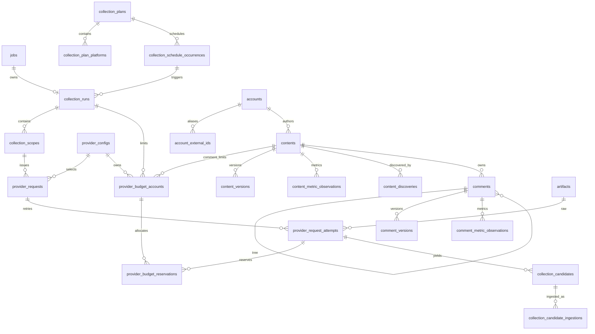

# 数据库与文件存储

本文定义 PostgreSQL 业务表、关系约束、历史模型、幂等策略、文件存储和备份恢复边界。

相关文档：

- [总体架构与技术选型](01-总体架构与技术选型.md)
- [采集系统与数据标准化](02-采集系统与数据标准化.md)
- [后端、任务、API 与前端](04-后端任务API与前端.md)
- [日志、安全、部署与运维](05-日志安全部署与运维.md)

## 1. PostgreSQL 原则

第一阶段只使用 PostgreSQL，不预先增加 Redis、OpenSearch 或消息队列。只有测量证明当前方案不能满足已批准 SLO，才增加新组件。

边界：

- `timestamptz` 保存所有业务时间；
- API 输出 UTC ISO-8601；
- 外部 ID 使用 `text`；
- 内部 ID 默认 UUID；
- 金额用 `numeric`，不使用 float；
- 核心关系必须有 FK/唯一约束；
- 不把核心查询字段藏进 `jsonb`；
- SQLAlchemy `Table` 定义是运行时机器事实，Alembic Revision 显式冻结 Schema 演进；
- 每张表只能有一个写 Owner。

## 2. 数据层角色

```text
Repository
→ 只封装持久化和查询
→ 不调外部 API
→ 不拥有 HTTP 语义

Service / Unit of Work
→ 组织跨 Repository 业务事务
→ 控制幂等与状态机

Migration
→ 只做 Schema 演进
→ 不在 API/Worker 启动时自动执行
```

Router 不写 SQL，Mapper 不访问数据库。

## 3. 数据模型分层

业务数据按以下层次组织：

```text
Current
→ 当前可查询状态

Version
→ 业务字段发生变化时追加

Metric Observation
→ 指标变化历史

Discovery / Provenance
→ 某次 Run/Scope/Request 如何发现对象

Raw Artifact
→ 外部响应证据，不参与业务唯一性
```

这使“当前查询”“历史变化”“来源追踪”“原始证据”分离。

## 4. 核心关系



### 4.1 运行与版本控制关系

- `jobs` 是异步执行事实；
- `collection_plans` 是长期采集配置；
- `collection_schedule_occurrences` 是计划触发实例；
- `collection_runs` 是一次业务采集运行；
- `collection_scopes` 是 Run 内最小执行切片；
- `provider_requests` 是 Provider 中立的逻辑请求；
- `provider_request_attempts` 是实际发送尝试和费用事实；
- `provider_budget_accounts` 是稳定 Provider Config 下的硬预算账户；
- `provider_budget_reservations` 是某 Attempt 对一个预算账户的追加账本；
- `collection_candidates` 保存某 Attempt 解析出的逐项候选事实；
- `collection_candidate_ingestions` 保存 Candidate → Canonical 业务对象的追加式导入结果。

### 4.2 表 Owner 边界

当前机器事实由 SQLAlchemy `Table.info['owner']` 和 `scripts/quality/check_table_ownership.py` 维护，不在 Markdown 复制完整可漂移映射。跨模块写入必须通过 Owner Service/Repository；与本 Blueprint 直接相关的稳定边界包括：

- `provider_configs`、`keyword_packs`、`keywords`、`keyword_pack_items`：System Owner；
- `collection_runs`、`collection_scopes`、`provider_requests`、`provider_request_attempts`、`provider_budget_accounts`、`provider_budget_reservations`：Collection Owner；
- `contents/comments` 及其版本/指标表：Content Owner；
- `artifacts`：Platform Owner；
- `jobs/job_attempt_events`：Platform Job Runtime Owner。

一个表不能被多个模块各自复制 SQL 写入。

## 5. 主要表

以下是长期业务语义和关键约束。已落地表的精确列、索引、约束名和默认值以当前 SQLAlchemy Table、Alembic Revision 和 PostgreSQL Integration Test 为机器事实；本节不复制第二套可漂移 DDL。

### 5.1 `accounts`

Canonical 作者实体：

```text
id                  uuid primary key
platform            text not null
external_account_id text not null
identity_source     text not null
nickname            text
avatar_url          text
profile_url         text
created_at          timestamptz not null
updated_at          timestamptz not null

unique(platform, external_account_id)
```

当 Provider 没有稳定账号 ID 时，先使用明确命名的备用身份来源，不能用 nickname 直接去重。Stage 6 已通过 `account_external_ids` 追加式映射表表达 `sec_user_id/user_id` 等已确认备用 ID，并用 `(platform, identity_source, external_account_id)` 唯一约束阻止同一备用身份绑定多个 Account；具体 Provider 私有字段名仍只存在于 Mapper/Fixture，不提升为公共 Contract。

### 5.2 `contents`

当前内容快照：

```text
id                  uuid primary key
platform            text not null
external_content_id text not null
content_type        text not null
account_id          uuid references accounts
external_author_id  text
published_at        timestamptz
first_seen_at       timestamptz not null
last_seen_at        timestamptz not null
current_version     integer not null
status              text not null
updated_at          timestamptz not null

unique(platform, external_content_id)
```

`status` 由受控枚举表达 `active/deleted/unavailable/unknown` 等状态，不能用任意字符串扩散业务语义。

### 5.3 `content_versions`

业务字段版本历史：

```text
id                  uuid primary key
content_id          uuid not null references contents
version_no          integer not null
business_hash       text not null
payload             jsonb not null
observed_at         timestamptz not null
provider_request_id uuid references provider_requests
raw_artifact_id     uuid references artifacts

unique(content_id, version_no)
```

规则：

- 只和当前版本的 `business_hash` 比较；
- 变化才新增版本；
- 历史上出现过相同 Hash 不阻止未来重新出现；
- 版本字段变化和指标变化分离。

### 5.4 `content_metric_observations`

```text
id                  uuid primary key
content_id          uuid not null references contents
provider_request_id uuid references provider_requests
observed_at         timestamptz not null
like_count          bigint
comment_count       bigint
share_count         bigint
collect_count       bigint
view_count          bigint
metric_hash         text not null
```

同一 Request 对同一内容的同一 `metric_hash` 可唯一，避免重放重复写；不同时间或不同 Request 的相同指标可以保留，因为它们仍是有效观测。

### 5.5 评论

```text
comments
  id                  uuid primary key
  content_id          uuid not null references contents
  platform            text not null
  external_comment_id text not null
  root_comment_id     uuid references comments
  parent_comment_id   uuid references comments
  account_id          uuid references accounts
  external_author_id  text
  published_at        timestamptz
  first_seen_at       timestamptz not null
  last_seen_at        timestamptz not null
  current_version     integer not null
  status              text not null
  updated_at          timestamptz not null

  unique(platform, content_id, external_comment_id)

comment_versions
  id                  uuid primary key
  comment_id          uuid not null references comments
  version_no          integer not null
  business_hash       text not null
  payload             jsonb not null
  observed_at         timestamptz not null
  provider_request_id uuid references provider_requests
  raw_artifact_id     uuid references artifacts

  unique(comment_id, version_no)

comment_metric_observations
  id                  uuid primary key
  comment_id          uuid not null references comments
  provider_request_id uuid references provider_requests
  observed_at         timestamptz not null
  like_count          bigint
  reply_count         bigint
  metric_hash         text not null
```

评论树规则：

- 一级评论 `root_comment_id = id` 或通过一致规则设置；
- 二级及更深评论 `root_comment_id` 指向一级评论；
- `parent_comment_id` 指向直接父评论；
- Provider 只返回两层时仍保留这套通用关系。

评论覆盖状态单独记录：

```text
comment_coverage_observations
  id                  uuid primary key
  content_id          uuid not null references contents
  provider_request_id uuid references provider_requests
  observed_at         timestamptz not null
  top_level_complete  boolean not null
  replies_complete    boolean not null
  total_reported      bigint
  fetched_count       bigint not null
  stop_reason         text
```

不能把“当前没抓到评论”当成“平台没有评论”。

### 5.6 `content_discoveries`

来源追踪：

```text
id                  uuid primary key
content_id          uuid not null references contents
run_id              uuid not null references collection_runs
scope_id            uuid not null references collection_scopes
provider_request_id uuid references provider_requests
discovery_kind      text not null
source_value        text
observed_at         timestamptz not null
```

同一内容可被多个关键词、话题、作者、热榜多次发现。

### 5.7 `collection_runs` 与 `collection_scopes`

Stage 5B 已建立最小 PostgreSQL 父事实：

```text
collection_runs
  id                uuid primary key
  job_id            uuid not null references jobs
  trigger_type      text not null
  config_snapshot   jsonb not null
  status            text not null
  started_at        timestamptz
  finished_at       timestamptz
  requested_count   integer not null default 0
  succeeded_count   integer not null default 0
  failed_count      integer not null default 0
  content_count     integer not null default 0
  comment_count     integer not null default 0
  error_summary     text
  created_at        timestamptz not null

  unique(job_id)

collection_scopes
  id                uuid primary key
  run_id            uuid not null references collection_runs
  platform          text not null
  source_type       text not null
  source_value      text not null
  operation_group   text not null
  status            text not null
  pagination_state  jsonb not null default '{}'
  progress          integer not null default 0
  stop_reason       text
  stats             jsonb not null default '{}'
  started_at        timestamptz
  finished_at       timestamptz

  unique(run_id, platform, source_type, source_value, operation_group)
```

Stage 5B 的 `trigger_type` 只允许 `manual/api/backfill`，不提前实现 `scheduled`；Scheduler 仍需先满足 07 的 misfire/catch-up 决策门禁。`collection_runs.job_id` 必须引用真实 `jobs`，Run/Scope 创建和 Job Enqueue 可在调用方持有的同一 Session/事务内完成。

### 5.8 `provider_requests`

`provider_requests` 表示可幂等的逻辑请求，不代表某一次网络调用。

```text
id                  uuid primary key
scope_id            uuid not null references collection_scopes
provider_config_id  uuid references provider_configs
provider            text not null
operation           text not null
request_fingerprint text not null
request_params      jsonb not null
pagination_input    jsonb not null default '{}'
status              text not null
attempt_count       integer not null default 0
estimated_cost      numeric(18,6) not null default 0
actual_cost         numeric(18,6) not null default 0
cost_currency       text
cost_unit           text
unit_price_snapshot numeric(18,6)
created_at          timestamptz not null
completed_at        timestamptz
error_code          text
error_detail        text

unique(scope_id, request_fingerprint)
```

`run_id` 和 `platform` 不在此表重复保存；通过 `scope_id → collection_scopes.(run_id, platform)` 获得，避免第三份来源事实。

`provider_config_id` 表达真实计费调用所使用的稳定 Provider 配置实例。第十二条 Revision 以可空列兼容历史/不计费 Request；新的 billable Attempt 在创建前必须绑定有效 Provider Config，且 Config 的 `provider` 必须与 Request 一致。同一 Provider 类型的多个 Config 可以并存，但预算和历史来源按 Config UUID 隔离。

`request_fingerprint` 是 64 位小写 SHA-256，由 `provider/platform/operation`、业务请求参数和分页输入的稳定 JSON 共同计算；平台来自 Scope，数据库唯一键只保留 `scope_id + fingerprint`。同一个逻辑请求发生真实重试时不新建 Request，而是在下面的 Attempt 表新增记录。

`provider` 在 Stage 5C 仍保留为 Provider Contract 的兼容字段；Stage 7 以后 billable 路径同时持久化稳定 `provider_config_id`，不能只靠 Provider 类型字符串表达账号/额度身份。

### 5.9 `provider_request_attempts`

Stage 5C 已建立最小未发送 Attempt，Stage 5D 冻结真实 Dispatch/Raw 终态约束，Stage 7 Budget 在此基础上使用计费 Attempt：

```text
id                         uuid primary key
provider_request_id        uuid not null references provider_requests
attempt_no                 integer not null
dispatch_status            text not null
dispatch_started_at        timestamptz
completed_at               timestamptz
http_status                integer
external_request_id        text
raw_artifact_id            uuid references artifacts
estimated_cost             numeric(18,6) not null default 0
actual_cost                numeric(18,6) not null default 0
cost_currency              text
cost_unit                  text
unit_price_snapshot        numeric(18,6)
billing_status             text not null
potential_duplicate_charge boolean not null default false
error_code                 text
error_detail               text
created_at                 timestamptz not null

unique(provider_request_id, attempt_no)
unique(id, provider_request_id)
```

`attempt_no` 通过锁住逻辑 Request 行串行分配；同一 `attempt_id` 的事务级重放必须返回相同记录，不重复增加 Attempt。

Stage 5D 已把 Request 状态限制为 `pending/dispatching/completed/not_sent/unknown`，Attempt 状态限制为 `reserved/dispatching/completed/not_sent/unknown`。真正调用 Provider 之前，先在受 Job Lease Token 约束的短事务中执行 `reserved → dispatching` CAS；只有赢得 CAS 的 Worker 才能在事务外调用 Provider Client。

Stage 7 billable Attempt 在 `reserved` 状态使用 `billing_status='estimated'` 并保存估算费用/币种；不计费 Fake/文件型路径继续使用 `not_billable`。billable Attempt 在发送前还必须存在完整 `provider_budget_reservations`；缺少任何必需账户/Reservation 时关闭失败，Transport 不得被调用。

`dispatching → completed/not_sent/unknown` 为一次性终态；`not_sent` 必须没有发送时间、没有 Raw 且不计费；`unknown` 表示已越过发送边界但费用/结果不确定，必须保守保留 `potential_duplicate_charge=true`，不能静默重发同一 Attempt。`completed/unknown` 可以关联同一 Attempt 的 Raw Artifact；`reserved/dispatching/not_sent` 不允许存在 Raw 终态引用。

Request 来源身份在已有 Attempt 后不可变。数据库触发器禁止修改 `scope_id/provider_config_id/provider/operation`，防止把已有费用、Raw、预算和历史来源改挂到另一条业务链。

### 5.10 `collection_candidates`

Candidate 不是临时内存对象，而是 Provider Attempt 产出的逐项可追踪事实。Stage 6 第一条小红书纵切先建立最小字段：

```text
id                          uuid primary key
provider_request_attempt_id uuid not null references provider_request_attempts
item_ordinal                integer not null
candidate_kind              text not null
discovery_context           jsonb not null
candidate_payload           jsonb not null
candidate_hash              text not null
created_at                  timestamptz not null

unique(provider_request_attempt_id, item_ordinal)
unique(provider_request_attempt_id, candidate_hash)
```

Candidate 只追加，不允许 UPDATE/DELETE。`candidate_kind` 必须受控；当前小红书先实现 `content/comment`，其他平台在各自纵切时补机器事实。Candidate 保存的是 Mapper/解析阶段已经脱敏且可安全持久化的业务候选，不复制完整 Raw。

### 5.11 `collection_candidate_ingestions`

Candidate → Canonical 的导入结果独立留痕：

```text
id                          uuid primary key
candidate_id                uuid not null references collection_candidates
ingestion_status            text not null
canonical_object_type       text
canonical_object_id         uuid
content_id                  uuid references contents
comment_id                  uuid references comments
business_hash               text
metric_hash                 text
created_version             boolean not null default false
created_metric_observation  boolean not null default false
created_at                  timestamptz not null
error_code                  text
error_detail                text

unique(candidate_id)
```

只追加，不允许 UPDATE/DELETE。`succeeded` 必须存在 Canonical 类型、对象 ID 和至少一个真实 `content_id/comment_id`；`failed` 必须有安全错误；`skipped` 可以没有业务对象，但必须有明确原因。这样 Raw Replay、重试和人工对账都能证明每个 Candidate 最终去了哪里。

### 5.12 关键词包

Stage 7 的关键词父事实已落地为 System Owner 表：

```text
keyword_packs
  id              uuid primary key
  name            text not null
  description     text
  enabled         boolean not null
  created_at      timestamptz not null
  updated_at      timestamptz not null

keywords
  id              uuid primary key
  text            text not null
  normalized_text text not null
  enabled         boolean not null
  created_at      timestamptz not null
  updated_at      timestamptz not null

  unique(normalized_text)

keyword_pack_items
  keyword_pack_id uuid not null references keyword_packs
  keyword_id      uuid not null references keywords
  created_at      timestamptz not null

  primary key(keyword_pack_id, keyword_id)
```

`normalized_text` 当前使用去首尾空白、折叠连续空白和 Unicode `casefold` 后的稳定值，只用于唯一性；原始 `text` 保留用户可读值。关键词关系是显式多对多，不把整包词 JSON 写进 Plan。Provider 参数翻译仍由各平台 Operation 负责。

### 5.13 `provider_configs`

Provider Config 是 System Owner 的长期父事实，表示某个稳定 Provider 配置实例：

```text
id              uuid primary key
provider        text not null
name            text not null
base_url        text not null
secret_ref      text not null
enabled         boolean not null
created_at      timestamptz not null
updated_at      timestamptz not null
```

数据库不保存 API Key/Token 明文，只保存 `secret_ref`。同一 Provider 可以有多个 Config；平台/Plan 选择具体 Config UUID，不能只存 `provider='tikhub'`。

### 5.14 `collection_plans`、平台配置与 Occurrence

Plan 是长期业务配置，不保存 Provider 私有分页状态。Stage 7 尚未完整落地以下父事实；其最终 Schema 必须在对应 Change 中以当前批准业务语义冻结，尤其不能在 Scheduler misfire/catch-up 值未批准时静默填默认值。

目标关系：

```text
collection_plans
  id
  name
  enabled
  timezone
  schedule_rule
  keyword_pack_id
  ...规范化业务策略...

collection_plan_platforms
  plan_id
  platform
  provider_config_id
  ...平台业务策略...

collection_schedule_occurrences
  id
  plan_id
  scheduled_for
  status
  ...
```

Plan Platform 绑定稳定 `provider_config_id`，Run 启动时再冻结实际快照；Provider 私有 endpoint、cursor、search_id 等仍由 Operation/Scope/Request 管理，不进入 Plan 公共 Schema。

### 5.15 `collection_run` 快照原则

计划触发 Run 时必须冻结能解释该次运行的配置快照。快照用于历史解释和重放，不作为第二套长期配置真相。

至少要冻结：

- Plan ID/版本或等价稳定引用；
- 关键词包解析结果；
- 平台 → Provider Config 选择；
- Decision Policy；
- 预算/评论/刷新等当次规范化业务策略；
- 调度 Occurrence 引用（scheduled Run 时）。

### 5.16 `jobs`

Stage 4 已建立 PostgreSQL Job Runtime：

```text
jobs
  id                       uuid primary key
  job_type                 text not null
  payload_version          text not null
  payload                  jsonb not null
  internal_idempotency_key text not null
  request_id               uuid
  priority                 integer not null
  status                   text not null
  attempt_count            integer not null
  max_attempts             integer not null
  timeout_seconds          integer not null
  available_at             timestamptz not null
  leased_at                timestamptz
  lease_expires_at         timestamptz
  attempt_deadline_at      timestamptz
  heartbeat_at             timestamptz
  lease_token              uuid
  worker_id                text
  cancel_requested_at      timestamptz
  started_at               timestamptz
  finished_at              timestamptz
  result                    jsonb
  error_code               text
  error_detail             text
  created_at               timestamptz not null
  updated_at               timestamptz not null

  unique(job_type, internal_idempotency_key)

job_attempt_events
  id                       uuid primary key
  job_id                   uuid not null references jobs
  attempt_no               integer not null
  event_seq                integer not null
  event_type               text not null
  from_status              text
  to_status                text
  worker_id                text
  lease_token              uuid
  safe_detail              jsonb not null
  created_at               timestamptz not null

  unique(job_id, event_seq)
```

Job Lease Token 负责 Fencing。Worker 更新 running Job 时必须带当前 Lease Token；超时/租约丢失的旧 Worker 不能继续提交业务写入。Reaper 负责把过期 running Job 转为 retryable/failed；取消只是设置请求并由 Worker 在安全边界退出。

### 5.17 Provider Budget Ledger

Stage 7 的最终预算不是布尔开关，而是绑定稳定 Provider Config 的显式硬预算账户和 Attempt Reservation 账本。数据库负责并发硬约束，业务层负责决定一次 Attempt 需要哪些层级。

#### 5.17.1 `provider_budget_accounts`

```text
id                  uuid primary key
provider_config_id  uuid not null references provider_configs
scope_type          text not null
scope_key           text not null
run_id              uuid references collection_runs
content_id          uuid references contents
period_start        timestamptz not null
period_end          timestamptz not null
dimension           text not null
unit                text not null
limit_amount        numeric(18,6) not null
reserved_amount     numeric(18,6) not null default 0
settled_amount      numeric(18,6) not null default 0
unknown_amount      numeric(18,6) not null default 0
enabled             boolean not null default true
created_at          timestamptz not null
updated_at          timestamptz not null
```

`scope_type` 只允许：

- `global`：该 Provider Config 的全局额度；
- `run`：单次 Run 总额度；
- `run_comments`：单次 Run 的评论/回复子额度；
- `content_comments`：单内容的评论/回复额度。

`dimension` 只允许：

- `request_count`，单位固定 `request`；
- `monetary_cost`，单位为大写三字母币种。

范围身份由 `scope_type + scope_key + run_id/content_id` CHECK 固化。相同 `provider_config_id + scope_key + dimension + unit` 的预算周期不得重叠；当前 PostgreSQL 通过 `btree_gist` + `tstzrange(period_start, period_end, '[)')` Exclusion Constraint 保护，避免同一时刻命中多个“当前账户”。

预算已用量按：

```text
used = reserved_amount + settled_amount + unknown_amount
```

判断。`unknown_amount` 是已越过发送边界但计费结果未知的保守占用，不能算作可用余额。

#### 5.17.2 `provider_budget_reservations`

```text
id                          uuid primary key
budget_account_id           uuid not null references provider_budget_accounts
provider_request_id         uuid not null references provider_requests
provider_request_attempt_id uuid not null
reserved_amount             numeric(18,6) not null
settled_amount              numeric(18,6)
status                      text not null
created_at                  timestamptz not null
updated_at                  timestamptz not null

unique(budget_account_id, provider_request_attempt_id)
foreign key(provider_request_attempt_id, provider_request_id)
  references provider_request_attempts(id, provider_request_id)
```

`status` 只允许 `reserved/settled/released/unknown`。同一 Attempt 对同一账户只有一条 Reservation；同一事务级重放必须返回现有相同 Reservation，不重复扣减。新网络 Attempt 必须创建新的 Attempt 并独立预留，不能复用上一 Attempt 的 Reservation。

#### 5.17.3 层级与并发规则

普通 billable Attempt 同时需要：

```text
global.request_count
global.monetary_cost
run.request_count
run.monetary_cost
```

评论或回复 Attempt 在有内部 `content_id` 时同时需要：

```text
global.*
run.*
run_comments.*
content_comments.*
```

Reserve 在一个短 PostgreSQL 事务中完成：

1. 校验 Attempt/Request/Run/Provider Config 来源链和 estimated 金额/币种；
2. 按稳定顺序锁住当前时刻覆盖的该 Provider Config 账户；
3. 验证所有必需账户都存在且 enabled；
4. 对每个账户检查 `used + 本次预留 <= limit_amount`；
5. 任一缺失或超额则整个事务失败，不留下部分 Reservation；
6. 全部满足才写 Reservation 并增加账户 `reserved_amount`。

发送边界前 `ProviderDispatchService` 再次验证当前 Attempt 的 Reservation 层级、金额、Provider Config 和预算周期仍完整；不完整时保持 Attempt 为 `reserved`，Transport 调用次数必须为 0。

#### 5.17.4 终态

- `completed`：请求次数结算为 1，货币维度按 Provider 返回的实际 `actual_cost` 结算；若实际费用高于估算仍如实写入 `settled_amount`，不能截断为预算上限，后续请求由超额状态阻断；
- `not_sent`：全量释放本 Attempt 的 Reservation，转 `released`；
- `unknown`：把原预留从 `reserved_amount` 移入 `unknown_amount`，Reservation 转 `unknown`，继续占用预算直到后续独立对账能力明确处理；
- 正常 Dispatch 与崩溃 Recovery 必须走同一预算终态持久化边界，避免遗留 `reserved` 假余额。

`audit_account` 从 Reservation 重算 `reserved/settled/unknown` 并与账户累计值比较；不一致时显式报 drift，不能自动覆盖假装一致。

本 Ledger 已作为 Stage 7 机器事实落地；它不等于已经实现 Provider 账单 reconciliation、预算管理 HTTP API/页面、自动充值或真实付费 Transport，也不解除 Plan/Scheduler 的独立门禁。

### 5.18 `artifacts`

Stage 3A 已落地元数据 Schema：

```text
id                  uuid primary key
artifact_type       text not null
storage_backend     text not null
storage_key         text not null
content_type        text not null
byte_size           bigint
sha256              text
retention_class     text not null
status              text not null
created_at          timestamptz not null
stored_at           timestamptz
linked_at           timestamptz
expires_at          timestamptz
last_error          text
```

唯一 `(storage_backend, storage_key)`；状态只允许 `pending/stored/linked/delete_pending/deleted/error`，并有状态字段一致性 CHECK。Stage 3A PostgreSQL Repository 正式实现 Stage 2 的 `ArtifactMetadataPort`，使用 `id + 当前状态` 条件更新推进 `pending → stored → linked` 或 `pending → error`；并发或非法转换更新不到行时关闭失败，不静默覆盖状态。

`retention_class` 只是未来保留策略的分类入口，`expires_at` 当前可空。具体 Raw/报告/审计保留期限尚未批准，本阶段不自动填写统一到期日，也不实现 Artifact 删除 Job。

### 5.19 `system_settings` 与 `audit_events`

Stage 3A 当前 System 持久化只建立两个 Provider 中立共享表：

```text
system_settings
  key                 text primary key
  value               jsonb not null
  version             integer not null default 1
  created_at          timestamptz not null
  updated_at          timestamptz not null

audit_events
  id                  uuid primary key
  actor_kind          text not null  # system | principal
  actor_ref           text
  event_type          text not null
  object_type         text
  object_id           text
  request_id          text
  safe_detail         jsonb not null default '{}'
  created_at          timestamptz not null
```

`system_settings` 只保存非敏感设置；Secret 继续使用 Secret 文件/未来 Secret Provider。Repository 对同 key upsert 时递增 `version`，调用方拥有事务。

`audit_events` 只追加，当前 Repository 不提供更新/删除接口。`actor_kind` 可表达 `system` 和未来 `principal`；第三方身份必须先映射内部 Principal，不能把飞书 `open_id`、`union_id`、Token 或 SDK 对象变成业务主键。

当前仍不建立本地 `users/sessions/auth_login_attempts`。未来 Principal/Role/Permission、第三方认证以及依赖 actor 的 API 幂等 Schema 都在真实认证需求明确后通过独立 L3 Change/Migration 冻结。

## 6. `jsonb` 使用边界

适合：

- Run 配置快照；
- 分页状态；
- Provider 脱敏请求参数；
- 不常查询的扩展元数据；
- Job Payload/Result；
- 报告参数。

不适合：

- 平台；
- 外部内容 ID；
- 关键词关系；
- 状态；
- 时间；
- 点赞、评论等常用指标；
- 需要唯一约束或索引的核心字段。

原则：

> 稳定且需要查询、约束、关联的字段用列；来源私有、变化快、低频查询的数据才用 `jsonb`。

## 7. 索引基线

必须按真实查询设计，不按“每列都加索引”。

核心索引：

```text
contents(platform, published_at desc, id)
contents(last_seen_at desc)
contents(status, published_at desc)
contents(external_author_id)

content_metric_observations(content_id, observed_at desc)
content_versions(content_id, version_no desc)

comments(content_id, published_at desc, id)
comments(content_id, root_comment_id, published_at, id)
comments(content_id, parent_comment_id, published_at, id)

collection_runs(status, created_at desc)
collection_scopes(run_id, status)
provider_requests(scope_id, created_at)
provider_request_attempts(provider_request_id, attempt_no)
provider_request_attempts(dispatch_status, dispatch_started_at)
provider_request_attempts(completed_at)

jobs(status, available_at, priority desc, created_at)
jobs(status, lease_expires_at)
jobs(status, attempt_deadline_at)
job_attempt_events(job_id, event_seq)
provider_budget_accounts(provider_config_id, period_start, period_end)
provider_budget_reservations(provider_request_attempt_id)
provider_budget_reservations unique(budget_account_id, provider_request_attempt_id)
```

中文检索方案必须在阶段 0 用真实脱敏中文语料和明确查询集做召回质量、延迟与 `EXPLAIN` 基准。至少比较 PostgreSQL 内置全文检索、`pg_trgm` 和经批准的中文分词扩展；只有基准选中某方案后才创建对应索引。第一阶段仍限定在 PostgreSQL 内，不预先承诺 `tsvector + GIN` 的中文效果；合理优化后仍达不到已批准 SLO 才单独评估 OpenSearch。

## 8. 事务边界

### 8.1 一次内容摄取

同一事务内：

- Upsert 当前内容；
- 写 Content Version；
- 写 Metric Observation；
- 写 Discovery；
- 写 Candidate Ingestion 结果；
- 更新 Run/Scope 计数。
- 如需触发 Analysis/Monitoring，把版本化 Job 与上述业务写入放在同一 PostgreSQL 事务中。

Raw 文件写入不放在数据库事务中，按 `pending → stored → linked` 生命周期衔接；数据库事务失败时保留可对账的 `stored` Artifact，并可从 Raw 重试。业务提交与下游 Job 入队使用同一 Unit of Work，使 PostgreSQL Job 表同时承担事务型 Outbox 的作用，避免“内容已提交但任务未创建”。

### 8.2 外部调用不能放在数据库事务中

禁止：

```text
BEGIN
→ 调 TikHub 等待 30 秒
→ 写库
→ COMMIT
```

正确：

```text
短事务创建 reserved Attempt 并原子取得必需预算
→ CAS reserved → dispatching
→ 调用 TikHub（同一 Attempt 最多一次）
→ Raw 落盘
→ 短事务把 Attempt/预算记为 completed/settled，或按边界记为 not_sent/released、unknown/unknown_amount
→ Mapper
→ 业务短数据库事务
```

创建预留、Dispatch CAS、网络调用和结果事务是明确的四个边界，不能把外部等待包进数据库事务。恢复时看到超时 `dispatching` 必须保守转 `unknown`，不得复发同一 Attempt；只有确定仍为 `reserved` 且未进入 Dispatch CAS 才能 `not_sent` 并释放。

### 8.3 幂等

每个可重试操作必须有明确幂等键：

- HTTP 创建请求：`actor + operation + Idempotency-Key + request_hash + 有效期`；
- 内部 Job：`job_type + internal_idempotency_key`；
- Provider Request：Scope + Request Fingerprint；
- Provider Attempt：逻辑 Request + Attempt Number；
- Provider Budget Reservation：Budget Account + Provider Attempt；
- Content：平台 + 外部内容 ID；
- Comment：平台 + 内容 + 外部评论 ID；
- Version：只将 Business Hash 与当前版本比较；历史相同 Hash 可以再次出现；
- Observation：内容 + Request + Observation Hash；
- Report：报告参数 Hash + 数据截止时间。

## 9. 表写入所有权

每张已落地表只有一个写 Owner，机器事实维护在 SQLAlchemy `Table.info['owner']`，`scripts/quality/check_table_ownership.py` 在 CI 中校验，禁止另维护一份可能漂移的完整表名映射。

本 Blueprint 直接涉及的稳定边界：

- `artifacts`：platform；
- `system_settings/provider_configs/keyword_packs/keywords/keyword_pack_items/audit_events`：system；
- `collection_runs/collection_scopes/provider_requests/provider_request_attempts/provider_budget_accounts/provider_budget_reservations`：collection；
- Canonical 内容、评论、版本和指标表：content；
- `jobs/job_attempt_events`：Platform Job Runtime。

完整当前清单始终由 Table 机器事实和 CI 计算。跨模块修改必须调用 Owner Service/Repository，禁止复制 SQL 越权写表。角色、Session、API 幂等等未建立表不应出现在“当前 Owner”清单中。

## 10. Migration

所有 Schema 演进使用根目录 `alembic.ini` + `migrations/`。当前 Alembic 链从 `20260813_0001` 演进到 `20260815_0012`；`0012` 直接以 `20260815_0011` 为父 Revision，为 `provider_requests` 增加稳定 Provider Config 关联，并建立最终 Provider Budget Ledger。

规则：

1. 已发布 Revision 禁止改写；后续变化新增 Revision；
2. API/Worker/Scheduler 启动不自动运行 Migration；Migration 是独立进程/命令；
3. Table 定义是运行时 Schema/Repository 的机器结构，Revision 显式冻结已批准变化；CI 使用 `alembic check` 防止二者漂移；
4. 第二条及后续 Revision 必须同时验证上一正式 Revision → head；CI 还应保留 `base → head` 往返验证，不能只验证 `base → head`；
5. downgrade 是开发/CI 可逆性证据，不替代生产 Backup Set 与数据回滚设计；
6. 任何新增表必须同时声明唯一 Owner 并通过 PostgreSQL Integration。

## 11. 分区和归档

第一版不预先给所有历史表分区。出现以下情况再增加月分区：

- 单表进入千万级并持续增长；
- 删除/归档造成长事务；
- 时间范围查询和 Vacuum 明显恶化；
- 实际执行计划证明分区有收益。

优先候选：

- `content_metric_observations`；
- `comment_metric_observations`；
- `provider_requests`；
- `audit_events`。

## 12. 文件存储

### 12.1 接口

当前生产接口以代码为准：

```python
class ArtifactStore(Protocol):
    @property
    def backend_name(self) -> str: ...
    def put(self, storage_key: str, data: bytes) -> StoredBytes: ...
    def read(self, storage_key: str) -> bytes: ...
    def exists(self, storage_key: str) -> bool: ...
```

Store 只处理 `storage_key` 和字节，不理解 Artifact UUID、数据库或权限。Artifact ID/元数据/生命周期由 `ArtifactService + ArtifactMetadataPort` 管理。删除接口当前故意不开放，因为访问、保留和删除规则仍是 Stage 0 用户决策门禁。

### 12.2 本地目录

```text
/data/AIMA_UGC/
├─ runtime/
│  ├─ data/
│  │  ├─ raw/
│  │  ├─ reports/
│  │  ├─ exports/
│  │  ├─ snapshots/
│  │  └─ temp/
│  └─ logs/
├─ postgres/
├─ backups/
│  ├─ postgres/
│  └─ files/
├─ releases/
└─ shared/
   ├─ env/
   └─ secrets/
```

临时文件只能写 `temp/`，成功后原子移动到最终目录。失败和超时后由清理任务按年龄删除临时文件。

### 12.3 路径安全

- Storage Key 由系统生成；
- 不允许用户输入直接成为文件路径；
- 解析后路径必须仍在配置根目录下；
- 文件名不使用标题、作者、手机号等敏感文本；
- 下载通过 Artifact ID 查库，不接受任意路径；
- 校验文件大小和类型；
- 上传文件限制扩展名、MIME 和解压大小。

## 13. 保留策略

当前**不冻结具体天数**。Stage 0 仍需用户批准个人信息、Raw、报告/导出、审计等数据的访问、保留、删除与合规规则；因此 Stage 3A 只建立可表达策略的 `retention_class` 与可空 `expires_at`，不自动删除任何业务 Artifact。

后续实现自动清理前至少必须满足：

- 用户已批准各 Retention Class 的具体期限/长期保留规则；
- 有明确访问权限与下载审计；
- 清理写审计事件；
- 不删除仍被业务记录引用的 Artifact；
- 支持 Dry Run，并先输出预计数量和容量；
- 清理作为持久化 Job 执行，不在普通 HTTP 请求中执行；
- 删除/保留动作与备份写屏障、引用检查、恢复方案兼容。

临时工作文件的技术性清理可以按独立运行目录规则处理，但不得借“临时文件”名义删除 Raw、报告、导出或审计业务证据。

## 14. 备份与恢复

### 14.1 PostgreSQL

- 按阶段 0 批准的 RPO 创建常规协调 Backup Set；其中 PostgreSQL 使用 `pg_dump --format=custom`；
- 发布前额外创建同样协调的 Backup Set；
- 备份完成后执行 `pg_restore --list`；
- 定期恢复到隔离数据库并运行一致性检查；
- 备份文件不与数据库放在同一唯一磁盘；
- 备份加密和访问权限按生产 Secret 管理。

### 14.2 Raw 和 Artifact

- 使用文件系统快照、rsync 或备份软件；独立增量文件副本只用于加速，不能单独宣称为恢复点；
- 常规恢复点和发布前协调备份都进入维护模式：暂停 Scheduler，停止新 Job 认领，等待/取消运行中 Job，并拒绝所有业务写请求；只读查询可以继续；
- 所有业务写 Unit of Work、Artifact `pending/stored/linked/delete` 生命周期、文件 rename/delete、维护对账和 Migration 在开始前都必须用专用数据库会话取得同一个固定键的**共享 session-level advisory lock**，取得后再读取维护 epoch；若已维护则释放并拒绝，否则持有到文件操作及最终数据库提交都结束。连接返回池前必须显式释放，异常连接直接丢弃；进程死亡由 PostgreSQL 会话关闭释放；
- 备份方启用维护 epoch 后取得同一键的**独占 `pg_advisory_lock`**。独占锁只有在此前所有共享持有者退出后才能成功，并阻止后来写者越过屏障；取得后再次确认 Scheduler/认领已停、运行 Job 为零、维护 epoch 未变，才记录协调截止点。锁键、获取顺序和超时由 Platform 单点实现，禁止每个模块自造；
- 从独占写屏障取得并建立协调截止点开始，持续持锁并冻结所有会创建/修改 Artifact 引用或文件的写入，直到 `pg_dump` 和文件快照都完成；任一捕获失败则整个 Backup Set 失败，不恢复调度；
- 记录统一的 Backup Set ID、数据库事务截止点和 Artifact 截止时间；数据库备份与文件快照必须属于同一协调检查点，不能只写相同名称；
- 恢复后校验 Artifact 表中的 SHA-256；
- 恢复后运行缺文件、孤儿文件、`pending/stored/linked` 状态对账；
- Raw 恢复不要求重写业务库，但所有截止点之前的已引用 Artifact 必须可打开。

该屏障是 Backup Set 一致性的必要协议，不是普通“页面进入维护模式”。测试必须让 API 写事务、Artifact rename、关联事务和删除分别停在屏障前后，证明独占锁等待所有在途共享写者排空，且截止点之后没有文件/引用变化。若目标存储不允许持有数据库会话覆盖文件操作，必须先设计并验证等价的写入登记表/epoch 协议，不能省略排空屏障。

### 14.3 恢复目标

阶段 0 必须批准 RPO、RTO、允许的数据损失窗口和磁盘预算。没有这些值时可以实现备份机制，但不能宣称生产恢复方案已验收。每个被标记为可恢复的常规/发布 Backup Set 都必须包含数据库与 Artifact 的同一协调截止点；若停写频率不满足 RPO，必须另行选定并实测一致性快照协议。每次 Release 必须在 Manifest 中记录采用的目标、实际恢复演练耗时和未满足项。

### 14.4 恢复验收

至少证明：

```text
新空目录
→ 恢复 PostgreSQL
→ 恢复文件
→ 启动目标 Release
→ 健康检查
→ 随机抽查内容、评论、Raw 和报告
→ 执行一个测试 Job
```

未做恢复演练的备份不能称为“已验证备份”。

## 15. 旧系统数据迁移

新系统 Schema 稳定后再开发一次性 Importer：

```text
旧库/旧文件
→ 只读导出
→ 映射到新 Canonical
→ 校验
→ 新系统 Ingestion
→ 对账报告
```

禁止让新业务代码长期兼容旧表。Importer 必须可重复运行、幂等、输出失败记录，不修改旧系统。