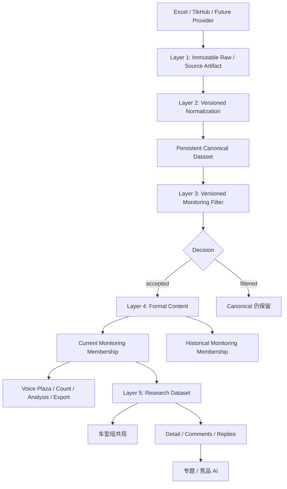
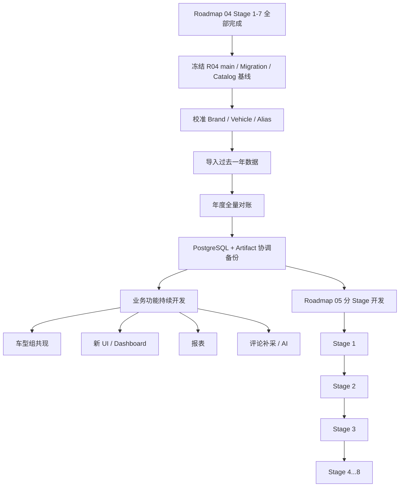
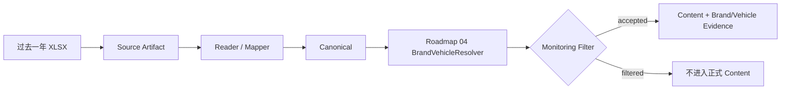
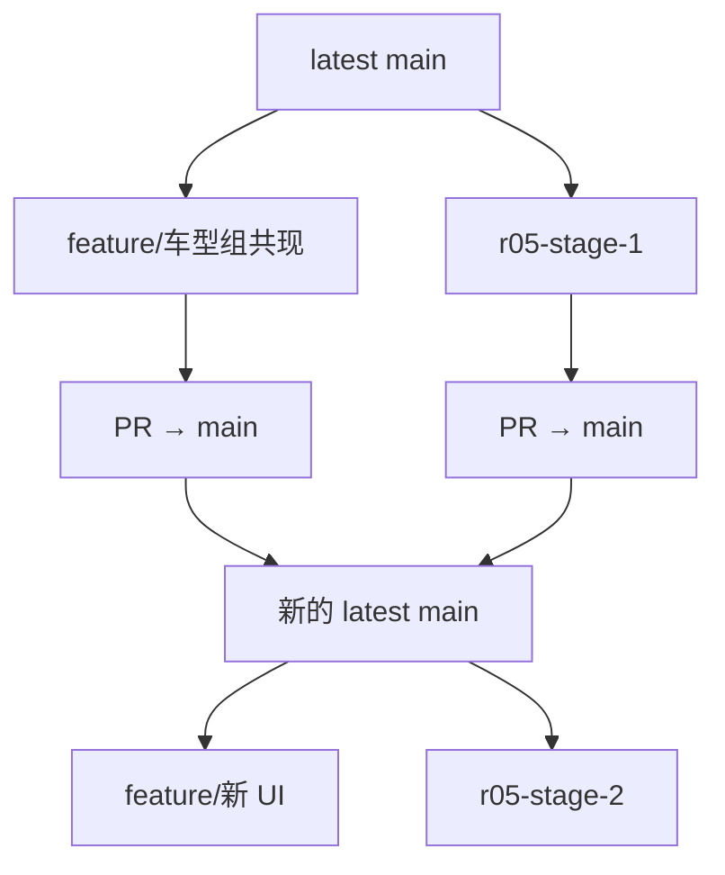
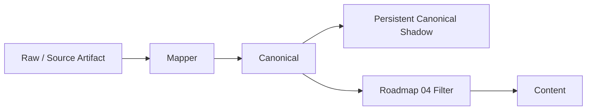
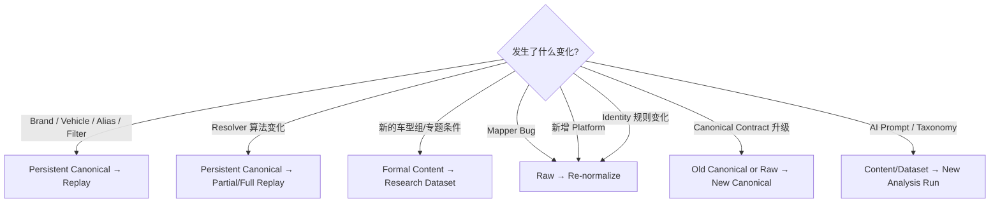
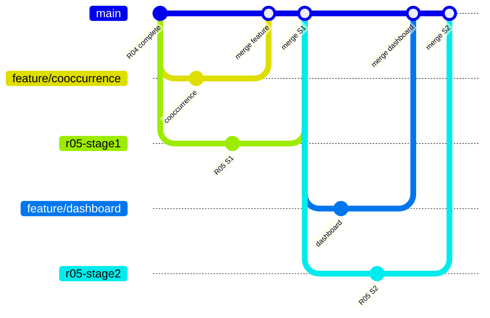

# 可重放数据底座与监测重分类实施路线

- 状态：Active
- 目标：在 [`docs/roadmap/04_搜索与品牌车型过滤实施路线.md`](04_搜索与品牌车型过滤实施路线.md) 完成后，把 AIMA_UGC 从“Canonical 经过一次 Monitoring Filter 后进入 Content”的链路升级为“Raw 永久可恢复、Canonical 持久且可重放、Monitoring Filter/Resolver 可版本化重算、Content 监测成员关系可追溯”的长期数据底座；同时允许基于 Roadmap 04 已导入的一年 Content 正常并行开发车型组共现、新 UI、报表、评论补采和 AI 等业务能力，不让本 Roadmap 的长周期建设阻塞业务开发。
- 退出条件：Roadmap 04 前置完成；Roadmap 04 完成后导入的一年基线数据完成来源/Content/Brand/Vehicle 对账和协调备份；Excel/TikHub 新数据均能形成版本化 Persistent Canonical；Roadmap 04 之前/之后已有 Raw/Source Artifact 可不重新获取原始数据完成 Canonical Backfill；Monitoring Filter Snapshot、Replay/Reclassification、Monitoring Membership、Current/History 查询语义形成闭环；平台身份与 Provider Capability 解耦；Voice Plaza/Count/Analysis/Export 等消费者完成统一切换；容量、恢复、对账、Cleanup 与长期文档同步完成。
- 依赖：Roadmap 04 Stage 1—7 全部完成；当前模块化单体、PostgreSQL + Alembic、ArtifactService/ArtifactStore、Canonical/Content Owner、Data Import Campaign、Collection Provider Request/Attempt/Raw、Vehicle Catalog、PostgreSQL Durable Job Runtime；正式 4000 万生产迁移继续受 [`docs/roadmap/03_4000万历史数据迁移实施方案.md`](03_4000万历史数据迁移实施方案.md) 的生产授权、容量和对账门禁约束。

本文是**已经由业务 Owner 批准、但尚未实现的后续 Roadmap**。当前实现仍以代码、Contract、Schema/Migration 和现有 Blueprint 为准。特别是，在本 Roadmap 对应 Stage 真正完成以前：

- 不得把 Persistent Canonical、Monitoring Membership、Platform Registry 等未来能力写成当前已经支持；
- 当前平台机器身份仍遵守 [`docs/blueprint/07_技术决策与实施门禁.md`](../blueprint/07_技术决策与实施门禁.md) 的五平台约束；
- 当前 Raw/Mapper/Canonical/Decision/Owner 主链仍遵守 [`docs/blueprint/02_采集系统与数据标准化.md`](../blueprint/02_采集系统与数据标准化.md)；
- PostgreSQL 与 ArtifactStore 的职责继续遵守 [`docs/blueprint/03_数据库与文件存储.md`](../blueprint/03_数据库与文件存储.md)。

---

## 1. 为什么 Roadmap 04 完成后还需要本 Roadmap

Roadmap 04 解决的是：

```text
Search Terms
≠
Monitoring Filter

Excel / TikHub
→ Canonical
→ BrandVehicleResolver
→ Brand/Vehicle Filter
→ Content
→ Brand / Vehicle Evidence
```

它使一篇正式 Content 可以同时属于多个 Brand、多个 Vehicle，并让 Voice Plaza、Analysis、Export 等正式消费者使用同一套 Brand/Vehicle 事实。

但它没有解决一个更上游的问题：

> **一条数据第一次没通过 Monitoring Filter，以后新增 Brand、Vehicle、Alias 或改 Resolver 时，怎样不重新上传 Excel、不重新付费请求 TikHub，就能再次筛选？**

如果只保留正式 Content：

```text
Raw
→ Canonical
→ Filter
→ accepted → Content
             ↑
       filtered 缺少长期可重放入口
```

那么未来监测规则扩大时，系统不得不回到原 Excel 或再次请求 Provider。对于一年乃至 4000 万级历史数据，这会产生重复解析、重复网络成本和无法稳定复现历史判断的问题。

因此，本 Roadmap 真正固定的是：

```text
Raw 永久可恢复
Canonical 版本化且可重放
Filter 版本化且可解释
Content 表达正式业务事实
```

而不是固定某一版 Brand/Vehicle Filter 永远不变。

---

## 2. 最终数据主链的五层心智



### 2.1 Raw

Raw 回答：

> 外部来源当时真正给了什么？

目标长期语义：

```text
Excel
→ 原始 XLSX Source Artifact

TikHub
→ Provider 原始 JSON Response Artifact

Future Provider / File
→ 尽量保持原来源格式的 Artifact
```

Raw 不因为当前 Mapper、平台、Brand 或 Vehicle 不认识就删除。

### 2.2 Canonical

Canonical 回答：

> AIMA 用统一内部 Contract 怎样表达这条外部事实？

目标仍复用当前公开 Canonical Contract，例如 `CanonicalContentV1` / `CanonicalCommentV1`，而不是建立 Excel Content、TikHub Content 两套业务模型。

本 Roadmap 新增的是 **Persistent Canonical**：Canonical 不再只作为临时/内存中间值，而是形成版本化、不可变、可重放的数据资产。

### 2.3 Monitoring Filter

Monitoring Filter 回答：

> 这条 Canonical 在某一版 Brand/Vehicle Catalog + Resolver + Filter Scope 下，是否属于当前监测对象？

它必须与 Canonical 分离：

```text
Canonical
≠ accepted / filtered

Filter Decision
= 某一版规则对 Canonical 的判断
```

### 2.4 Content

Content 回答：

> 哪些内容已经正式进入 AIMA 业务事实库？

Persistent Canonical 中存在，不代表它必须进入 `contents`。只有正式 Monitoring Decision `accepted` 的内容才由 Content Owner 收敛到正式 Content。

### 2.5 Research Dataset

Research Dataset 回答：

> 从已经进入正式监测库的 Content 中，本次专题研究到底选哪些固定版本？

车型组共现、竞品对比、评论补采和专题 AI 都属于这个层，而不是数据来源层的 Monitoring Filter。

---

## 3. Roadmap 04 完成后的固定操作顺序

本 Roadmap 不要求 Roadmap 04 完成后立即停止业务、先花数周重构底座。固定顺序是：



### 3.1 冻结 R04 基线

Roadmap 04 完成并 merge `main` 后，先记录：

```text
main revision
Alembic migration head
Brand/Vehicle Catalog Version
当前 Brand / Vehicle / Alias 配置
当前 Resolver revision / version identity
Content 数量
Brand Evidence 数量
Vehicle Evidence 数量
```

这里的“冻结”是可追溯运行基线，不表示把代码或数据库长期锁死。

### 3.2 导入前先校准 Brand / Vehicle / Alias

一年数据第一次 Monitoring Filter 的召回与误判很大程度取决于 Alias。

正式年度导入前至少先做小规模抽样：

```text
真实样本
→ Resolver
→ accepted / filtered
→ 人工抽样
→ 修正过宽 / 错误 Alias
→ 发布 Catalog
```

尤其避免未经验证的宽泛词，例如只有 `Air`、`Pro`、`Max` 这类容易跨品牌/跨语境误命中的 Alias。

---

## 4. 过去一年数据怎样导入

### 4.1 Excel

继续复用正式 Data Import Campaign，不新增临时 ETL：



这一阶段 Roadmap 05 尚未完成，因此一年数据首先按 Roadmap 04 的正式生产语义进入业务库。

年度导入期间必须确保：

- 原 XLSX Source Artifact 和 SHA-256 保留；
- Campaign / Batch / Source Artifact 关系可追溯；
- Roadmap 05 Stage 3 Backfill 完成前，不允许把这些正式引用 Source Artifact 当孤儿清理；
- accepted / filtered / duplicate / invalid / created / updated 等适用结果可对账；
- Content、Brand Evidence、Vehicle Evidence 可以反查来源。

当前 File Import 的真实现状与入口继续以 [`docs/appendix/08_数据入口与统一入库实现.md`](../appendix/08_数据入口与统一入库实现.md) 为当前说明。

### 4.2 TikHub

继续使用正式 Collection 链：

```text
Collection Run
→ Scope
→ Provider Request
→ Attempt
→ Raw Artifact
→ Candidate
→ Mapper
→ Canonical
→ Roadmap 04 Filter
→ Content
```

Roadmap 05 不要求为了历史 Backfill 再次调用 Provider。已经存在 Raw Artifact 时，后续重归一化必须优先复用 Raw。

### 4.3 “过去一年”不是 4000 万正式生产迁移的替代

本 Roadmap 允许：

```text
Roadmap 04 完成
→ 先导入过去一年业务急需数据
→ 立即做研究和 UI
→ Roadmap 05 后续补齐 Persistent Canonical
```

但完整 4000 万正式生产 Campaign 继续由 Roadmap 03 管理，默认在本 Roadmap 的可重放数据底座和新容量证据完成后再执行。

---

## 5. 年度数据导入后的全量对账

年度导入不能以“Job succeeded”作为唯一完成条件。

至少闭合：

```text
输入行 / Provider Candidate
↔ Mapper 成功 / invalid
↔ accepted / filtered
↔ duplicate
↔ created / updated / filled / unchanged
↔ Content
↔ Brand Evidence
↔ Vehicle Evidence
↔ Source Artifact / Raw Artifact
```

建议至少按以下维度统计：

```text
平台
月份
来源 Campaign / Collection Run
Brand
Vehicle
accepted / filtered
invalid
duplicate
```

如果发现异常，必须能从 Content 或结果反向定位到 Source Artifact / Raw Artifact，而不是依赖临时日志猜测。

年度对账完成后，进入 Roadmap 05 前建立 PostgreSQL + Artifact 的协调备份基线。

---

## 6. Roadmap 05 期间业务开发不得停

Roadmap 05 会持续多个 Stage，但这不构成冻结其他产品开发的理由。

固定原则：

> **业务 Feature 使用正式 Content Read Contract；Roadmap 05 逐 Stage 以 Main-safe 方式增加底层能力。**



禁止建立：

```text
main@R04
└─ roadmap05-long-lived
   └─ 数周 / 数月以后一次性 merge
```

每个 Roadmap 05 Stage 都从当时最新 `main` 开工、完成、验证、PR、merge，再开始下一 Stage。

---

## 7. 基于 Roadmap 04 立即开发车型组共现

Roadmap 04 完成以后，正式 Content 已经允许多 Vehicle Evidence，因此车型组共现不需要等待 Roadmap 05。

### 7.1 第一版固定语义

例如：

```text
Group A
爱玛：元宇宙 OR 墩墩

AND

Group B
雅迪：莱茵 OR 麦芒
```

查询必须表达：

```text
EXISTS(Content 当前版本命中 [元宇宙, 墩墩])
AND
EXISTS(Content 当前版本命中 [莱茵, 麦芒])
```

不能把它错误实现成：

```text
元宇宙 OR 墩墩 OR 莱茵 OR 麦芒
```

第一版固定：

```text
组内 OR
组间 AND
```

不开发通用 Boolean AST。

### 7.2 推荐产品边界

普通声音广场继续承担日常 Content 查询。

车型组共现更适合作为“专题研究 / Research Dataset”能力：

```text
配置 Vehicle Groups
→ 预览 Count
→ 创建 Dataset
→ 冻结 Content ID + Content Version
→ Dataset 详情
→ 可选 Detail / Comments 补采
→ 可选专题 AI
```

具体 Route、页面名称、Figma 和 API 路径必须在实际 Feature 开工时基于当时最新 Contract/设计事实决定；本文只固定业务语义。

### 7.3 Research Dataset 必须冻结

Dataset 不能只保存一条会漂移的查询条件。

至少冻结：

```text
query definition
Catalog / Vehicle identity
created_at
content_id
content_version
ordinal
```

这样今天筛出的 2,436 条内容，明天即使 Content Current 或 Monitoring Membership 变化，本次研究仍可复现。

---

## 8. 新 UI / Dashboard / 报表如何与 Roadmap 05 解耦

前端只允许依赖稳定业务 Read Contract：

```text
Content
Brand
Vehicle
Analysis
Monitoring Status（Stage 6 之后）
Research Dataset
Comments
```

禁止 UI 直接依赖：

```text
Raw Artifact
Canonical Chunk
Normalization Run
Filter Result Artifact
Roadmap 05 私有 staging table
Artifact storage_key
```

因此后台可以逐步从：

```text
Raw → Canonical → Roadmap 04 Filter → Content
```

迁移到：

```text
Raw → Persistent Canonical → Versioned Filter → Membership → Content Read Model
```

而已经完成的业务 UI 不需要理解底层迁移过程。

前端生产实现仍必须遵守 [`docs/blueprint/07_技术决策与实施门禁.md`](../blueprint/07_技术决策与实施门禁.md) 的真实 Contract 类型链，不从 Figma 或页面示例猜 API。

---

## 9. Roadmap 05 跨 Stage 硬门禁

### 9.1 每个 Stage 必须 Main-safe

除明确 Consumer Switch Stage 外，每个 Stage merge `main` 后：

```text
现有 Roadmap 04 Excel/TikHub 主链继续工作
现有 Content 继续可查询
已有 UI 继续可使用
已有 Analysis / Export 不因半迁移失效
```

如果一个 Stage 做到一半会让 `main` 进入“旧链不可用、新链未接完”的状态，必须继续拆 Stage，而不是合并半成品。

### 9.2 固定迁移节奏

```text
Expand
→ Additive Capability
→ Shadow
→ Backfill
→ Replay
→ Membership
→ Consumer Switch
→ Cleanup
```

### 9.3 不建立第二套任务系统

Normalization Backfill、Filter Replay、Reclassification 等正式长任务必须复用当前 PostgreSQL Durable Job Runtime，不新增第二套 Worker/Queue/Kafka/Redis。

### 9.4 不建立第二业务数据库

PostgreSQL 继续保存业务身份、Run/Job/Dataset/Chunk 元数据、关系和状态。

大体量 Raw / Canonical / Filter Result 字节继续通过 ArtifactService/ArtifactStore 管理。

### 9.5 不把未来状态写成当前事实

Stage 未完成前：

- 不更新 Blueprint 为“当前已经使用 Persistent Canonical”；
- 不更新平台说明为“已经支持任意 Platform”；
- 不让 UI 调用尚未存在的 Contract。

只有 Stage 真正实现、验证、Consumer 切换后，再把长期有效事实同步到 Blueprint/Product/Appendix/Operations。

---

## 10. Raw 与 Persistent Canonical 的目标格式和存储

### 10.1 Raw

Raw 保持来源原格式：

| 来源 | Raw |
| --- | --- |
| Excel | 原始 `.xlsx` |
| TikHub | Provider 原始 JSON Response |
| Future Provider | 尽量保持 Provider 原始格式 |
| Future File | 原始 CSV/XLSX/JSONL 等 |

目标存储：

```text
ArtifactStore
→ bytes

PostgreSQL
→ Artifact ID / metadata / SHA-256 / lifecycle / lineage
```

不要把所有 Raw Payload 直接塞进 PostgreSQL JSONB。

### 10.2 Persistent Canonical

Canonical 继续以当前 Canonical Contract 为业务语义，不复制第二套字段定义。

针对百万/千万级数据，目标物理形态优先使用版本化、有界的 gzip JSONL Chunk Artifact，例如概念上的：

```text
normalized-content.chunk.v1
```

单行 Normalization Result 只需要表达：

```text
source locator / ordinal
normalization status
canonical schema version
Canonical payload（成功时）
error code（失败时）
```

Normalization Status 首版固定区分：

```text
normalized
unresolved_platform
invalid
```

Monitoring Filter 的：

```text
accepted
filtered
matched Brand
matched Vehicle
```

不得重新混入 Canonical 本体。

### 10.3 为什么不是所有 Canonical 都写 `contents`

假设：

```text
1000 万成功 Canonical
→ Roadmap 04 Filter 只接受 300 万
```

正式 Content 应仍然只有需要监测的 300 万。

其余 700 万是可重放数据资产，不应因为“可能以后用到”就污染 Voice Plaza、Analysis、Export 的正式业务集合。

---

## 11. Filter Snapshot 与 Decision 的版本语义

### 11.1 Snapshot 不可原地修改

```text
F20
Catalog v20
Resolver v1

发布新车型

F21
Catalog v21
Resolver v1
```

不得：

```text
UPDATE F20
```

否则历史判断无法复现。

### 11.2 Filter Snapshot 至少冻结的语义

精确 Schema 留给对应 Stage 的真实 Migration/Contract 决定，但必须能恢复：

```text
Filter identity
Catalog identity/version
Resolver identity/version
filter_mode
selected Brand scope
有效 Brand / Vehicle / Alias 快照或可验证引用
发布时间
发布人/Principal（项目正式身份可用时）
change summary
```

### 11.3 大规模 Decision 不要求每版制造海量数据库行

对于数千万 Canonical × 多 Filter Version，不默认建立“每条 Canonical × 每个 Filter Version”永久 PostgreSQL 宽表。

推荐：

```text
Filter Run / Snapshot / Chunk metadata
→ PostgreSQL

完整批量 accepted/filtered result
→ versioned Artifact chunks

已进入 Content 的当前/历史 Monitoring Membership
→ PostgreSQL
```

具体物理实现由对应 Stage 以真实容量证据决定。

---

## 12. Reclassification 的固定语义

新增 Brand / Vehicle / Alias 后：

```text
Persistent Canonical
→ New Filter Snapshot
→ Reclassification Run
→ newly accepted / still accepted / exited / filtered
→ Content reconciliation
```

**不得重新请求 TikHub，也不得要求重新上传 Excel。**

### 12.1 增量还是全量

根据 Filter Diff 自动规划：

| 变化 | 推荐扫描范围 |
| --- | --- |
| 新增 Brand | previous filtered |
| 新增 Vehicle | previous filtered |
| 新增 Alias | previous filtered |
| 删除 Alias | affected accepted + 必要 filtered |
| 删除 Vehicle | affected accepted |
| Vehicle 改 Brand | affected 内容 |
| Brand 停用 | affected accepted |
| Resolver 算法变化 | 通常 full |
| Canonical/Mapper 变化 | 先 Re-normalize，再 Filter |

Planner 应根据变更事实决定 `incremental/full`，不要求管理员自己猜。

---

## 13. Monitoring Membership 的最终语义

Roadmap 05 完成后必须区分三个集合：

```text
Current Monitoring Content
⊆ Historical Monitoring Content
⊆ Persistent Canonical Pool
```

### 13.1 Historical Monitoring Content

历史上至少有一次正式 Monitoring Decision `accepted`，因此已经形成正式 Content。

### 13.2 Current Monitoring Content

最新有效 Monitoring Filter 下仍然属于监测范围的 Content。

### 13.3 范围收缩时不删除 Content

例如删除错误 Alias 后：

```text
过去：accepted
现在：filtered
```

不得物理删除 Content / Version / Raw / Evidence 历史。

而是：

```text
Monitoring Membership
→ monitored → exited
```

---

## 14. Voice Plaza 最终切换

Stage 6 以前，现有 Voice Plaza 行为保持 Roadmap 04 当前 Contract。

Stage 6 完成后：

默认：

```text
Current Monitoring Content
```

同时提供可理解的监测状态：

```text
当前监测
已退出监测
全部历史纳入
```

帖子详情目标至少能解释：

```text
当前监测状态
首次纳入时间
首次纳入 Filter Version
最新 Filter Version
Catalog / Resolver identity
命中 Brand / Vehicle
最近 Reclassification Run
```

管理员配置侧增加规则版本/重分类历史，使用户能够回答：

> 为什么这条帖子以前没有，现在出现了？

---

## 15. Platform Registry 与 Provider Capability 解耦

### 15.1 当前边界

当前 Blueprint 和机器 Contract 只允许五个平台。在 Stage 7 真正完成前，这仍是当前有效约束。

### 15.2 Stage 7 目标

未来需要明确区分：

```text
Platform Registry
→ AIMA 能识别、保存、查询什么平台

Provider Capability
→ TikHub / 其他 Provider 对某平台支持 Search / Detail / Comments 哪些 Operation
```

例如：

```text
zhihu
→ AIMA 可以保存 / Analysis
→ TikHub Search unsupported
→ TikHub Comments unsupported
```

仍然是合法状态。

### 15.3 未识别平台不是垃圾数据

在平台尚未注册时：

```text
unresolved_platform
```

不应直接等同：

```text
invalid
```

未来注册新 Platform 后：

```text
旧 Raw
→ 新 Platform Mapper / Identity
→ New Canonical
→ Monitoring Filter
```

不重新取得原始数据。

### 15.4 Stage 7 是 L3 长期决策变化

它会改变当前 [`docs/blueprint/07_技术决策与实施门禁.md`](../blueprint/07_技术决策与实施门禁.md) 的五平台长期约束，因此 Stage 7 实施时必须：

```text
Expand Contract/Schema
→ Backfill / Compatibility
→ Consumer Switch
→ 新鲜验证
→ 再更新 Blueprint 长期决定
```

不能现在提前把未来状态写成当前事实。

---

## 16. Roadmap 05 Stage 状态

| Stage | 状态 | 依赖 | 主要结果 |
| --- | --- | --- | --- |
| Stage 1 Replay Metadata & Lifecycle Expand | blocked | Roadmap 04 完成 + 年度数据基线/备份 | Normalization Dataset/Run/Chunk、版本身份与 Artifact lifecycle 基础；不改现有行为 |
| Stage 2 Pure Canonical Shadow Persistence | blocked | Stage 1 | Excel/TikHub 新数据额外持久化 Pure Canonical，Roadmap 04 主链继续工作 |
| Stage 3 年度数据 Persistent Canonical Backfill | blocked | Stage 2 | 已导入一年 Excel/TikHub 不重新获取 Raw 即补齐 Persistent Canonical |
| Stage 4 Versioned Monitoring Filter & Replay Preview | blocked | Stage 3 | Filter Snapshot/Run/Result Artifact；历史重筛先 Preview，不改正式 Membership |
| Stage 5 Reclassification & Monitoring Membership | blocked | Stage 4 | 增量/全量重分类、newly accepted/exited、Content Membership 历史 |
| Stage 6 Consumer Switch & Traceability UI | blocked | Stage 5 | Voice Plaza/Count/Analysis/Export 使用 Current Monitoring，规则/帖子可追溯 |
| Stage 7 Platform Registry & Provider Capability | blocked | Stage 6 | 平台身份从固定五平台演进为可扩展 Registry，Capability 独立 |
| Stage 8 Capacity / Backup / Cleanup / Roadmap Closure | blocked | Stage 1—7 | 大规模容量与恢复、最终对账、Legacy Cleanup、长期文档同步与 Roadmap 收口 |

`blocked` 表示当前上游前置尚未满足，不表示方案未批准。

---

# Stage 1：Replay Metadata & Lifecycle Expand

## 目标

只建立可重放数据资产的控制事实，不改变 Roadmap 04 现有用户行为。

目标能力至少覆盖：

```text
Normalization Run
Normalized Dataset
Normalized Chunk
Raw lineage
Mapper identity/version
Canonical schema identity/version
Artifact lifecycle
status / statistics
```

## 设计边界

- PostgreSQL 保存业务身份、Run/Dataset/Chunk 元数据和 Artifact 引用；
- Canonical 大字节仍进入 ArtifactStore；
- 不建立第二业务数据库；
- 不把完整 Canonical Payload 复制成新的 PostgreSQL 大宽表；
- 不修改 `contents` 当前业务语义。

## Main-safe 退出条件

Stage merge 后：

```text
Excel → Roadmap 04 → Content
TikHub → Roadmap 04 → Content
Voice Plaza / Analysis / Export
```

均保持原行为。

---

# Stage 2：Pure Canonical Shadow Persistence

## 目标

新数据继续按 Roadmap 04 正常进入 Content，同时额外形成 Persistent Canonical：



## 硬规则

- Shadow persistence 失败不能伪装成成功；
- Canonical identity/version 可追溯回 Raw；
- 同 Raw + 同 Mapper + 同 Canonical Contract 应产生确定性等价 Canonical；
- Canonical 不带 Monitoring accepted/filtered；
- UI 不读取 Shadow。

## 退出条件

- Excel 与 TikHub 都有直接 Evidence；
- Artifact 重试/接管不制造重复逻辑 Dataset；
- 现有 Content 行为不变。

---

# Stage 3：年度数据 Persistent Canonical Backfill

## 目标

把 Roadmap 04 完成后已经导入的一年数据补成新的可重放 Canonical 底座。

## Excel

```text
已有 XLSX Source Artifact
→ 当前批准 Mapper
→ Pure Canonical Chunk
→ Persistent Canonical Dataset
```

不要求用户重新上传。

## TikHub

```text
已有 Provider Raw Artifact
→ 当前批准 Mapper
→ Pure Canonical Chunk
→ Persistent Canonical Dataset
```

不重新请求 TikHub。

## Backfill 不变量

```text
不修改现有 Content Current
不自动重新 Filter
不自动触发 Analysis
不覆盖旧 Raw
```

## 对账

至少闭合：

```text
Source/Raw 数量
↔ normalized
↔ unresolved_platform
↔ invalid
↔ Canonical Chunk row_count
↔ Artifact / Dataset metadata
```

---

# Stage 4：Versioned Monitoring Filter & Replay Preview

## 目标

将 Roadmap 04 已有 Catalog Snapshot/Resolver 进一步变成对 Persistent Canonical 可重放的正式 Filter Run。

```text
Persistent Canonical
+ Immutable Filter Snapshot
+ Resolver identity
→ Filter Run
→ Result Artifact
→ Statistics
```

## 第一阶段只允许 Preview

Preview 可以输出：

```text
newly accepted
still accepted
would exit
still filtered
```

但不能自动改变正式 Content Membership。

## 退出条件

- Same Canonical + Same Filter Snapshot + Same Resolver → Same Decision；
- Filter Snapshot 不可原地修改；
- Replay 支持 retry/cancel/progress/checkpoint；
- 不发生 Provider HTTP；
- 不重新读取用户原始文件路径。

---

# Stage 5：Reclassification & Monitoring Membership

## 目标

把 Preview 升级为正式、可恢复的 Content reconciliation。

```text
New Filter Snapshot
→ Reclassification Plan
→ Shard / Chunk Jobs
→ Decisions
→ Content Owner / Membership reconciliation
```

## Membership

必须至少表达：

```text
content_id
first accepted identity
latest evaluated filter identity
current state = monitored | exited
first accepted time
latest evaluated time
latest reclassification run identity
```

精确字段/表名由开工时当前 Schema 与 Owner 设计决定，本文不复制未来 DDL。

## 幂等与恢复

- Job Retry 不产生第二份 Content；
- 同一 Filter Run 重放不重复推进 Membership；
- Cancel/Failure 后已提交 Chunk 可对账；
- 新增范围可使历史 filtered → accepted；
- 缩小范围可使 monitored → exited；
- 不物理删除历史 Content。

---

# Stage 6：Consumer Switch & Traceability UI

## 目标

把正式消费者统一切到 Current Monitoring Membership，并向人类暴露必要追溯。

需要重新核对并同步的消费者至少包括：

```text
Voice Plaza List
Count
Analysis target
Export
Research Dataset source query
```

## Voice Plaza

默认只展示：

```text
current state = monitored
```

并支持查看：

```text
当前监测
已退出监测
全部历史纳入
```

## Detail

目标展示：

```text
首次纳入
当前状态
Filter Version
Catalog / Resolver identity
命中 Brand / Vehicle
Reclassification Run
```

## Admin

增加：

```text
Filter Version History
Catalog / Alias diff
Reclassification Run
newly accepted / exited statistics
```

## Main-safe 切换

Consumer Switch 必须作为一个完整 Stage 交付，不能 merge：

```text
Backend 已按 Membership
但 Frontend/Analysis/Export 仍各自猜旧逻辑
```

---

# Stage 7：Platform Registry & Provider Capability

## 目标

解除“系统能保存的平台 = 当前 TikHub 五个平台”的长期耦合。

### Platform

表达：

> AIMA 内部这条 Content 属于哪个平台？

### Provider Capability

表达：

> 某 Provider 对该 Platform 支持哪些 Search/Detail/Comments 等 Operation？

二者不再互相推导。

## Migration

至少按：

```text
Expand
→ 现有五平台映射
→ Contract / DB compatibility
→ Consumer Switch
→ Backfill
→ Cleanup
```

执行。

## 验证

至少需要：

- 当前五平台所有现有 Content 不发生身份漂移；
- 新注册 Platform 能从 File/Raw 形成合法 Canonical；
- Provider 不支持该平台时能够明确表达 unsupported，而不是拒绝整个 Content；
- 历史 unresolved platform Raw 可重归一化；
- 前端平台筛选值来自正式后端 Contract/Registry。

---

# Stage 8：Capacity / Backup / Cleanup / Roadmap Closure

## 目标

证明新数据底座不仅逻辑正确，而且能够承担年度和正式大规模数据。

## 容量重新验证

Persistent Canonical 新增：

```text
压缩 CPU
Artifact I/O
Canonical Artifact disk growth
Normalization metadata
Replay I/O
Reclassification I/O
```

因此不能直接继承旧“Filter → Content”容量结论。

至少重新执行与实际生产规模匹配的阶梯：

```text
10 万
→ 100 万
→ 500 万真实目标服务器或业务 Owner 批准的等效比例
→ 4000 万窗口评估
```

## Backup / Restore

必须验证：

```text
PostgreSQL
+
Raw / Canonical / Filter Result Artifact
```

协调恢复后仍能：

```text
Raw → Canonical
Canonical → Filter
Filter → Membership
```

## Cleanup

只有新消费者全部切换、历史 Backfill 完成、恢复和容量证据成立后才删除临时 Compatibility/Shadow/Legacy。

## Roadmap 收口

长期有效知识迁移到：

- Blueprint：长期 Raw/Canonical/Filter/Membership/Platform 边界；
- Product：当前用户可见监测状态/规则版本；
- Operations：Replay/Reclassification/Backup/大规模执行；
- Appendix/模块 README：当前实现入口；
- Change/Git：施工与验收历史。

迁移完成后，本文件退出 live `docs/roadmap/`。

---

## 17. 与 4000 万历史数据 Roadmap 的固定关系

[`docs/roadmap/03_4000万历史数据迁移实施方案.md`](03_4000万历史数据迁移实施方案.md) 继续拥有：

```text
公司服务器容量
生产写授权
正式 4000 万 Campaign
全量生产对账
```

本 Roadmap 拥有：

```text
Persistent Canonical
Replay
Filter Versioning
Reclassification
Monitoring Membership
```

固定执行顺序：

```text
Roadmap 04 完成
→ 一年业务数据可先导入和使用
→ Roadmap 05
→ 新数据路径容量重新验证
→ Roadmap 03 正式 4000 万 Campaign
```

环境准备、备份方案、生产授权准备可以与 Roadmap 05 并行，但默认不在旧“无 Persistent Canonical”主链上先跑完整 4000 万正式生产数据，再做第二次大规模 Backfill。

---

## 18. 未来发生变化时从哪一层重放



| 变化 | 重新上传 Excel | 重新请求 TikHub |
| --- | ---: | ---: |
| 新增 Brand | 否 | 否 |
| 新增 Vehicle | 否 | 否 |
| 新增 Alias | 否 | 否 |
| 修改 Monitoring Scope | 否 | 否 |
| Resolver 升级 | 否 | 否 |
| 新 Research Dataset | 否 | 否 |
| Mapper 修复 | 否，读旧 Source Artifact | 否，读旧 Raw Artifact |
| 新增 Platform | 否，读旧 Source Artifact | 否，读旧 Raw Artifact |
| Canonical 升级 | 通常否 | 通常否 |

所以真正需要长期保护的安全底线是 Raw/Source Artifact，而不是任何一次筛选结果。

---

## 19. Retention 原则

如果业务目标是“几年后新增车型仍能重新筛旧数据”，正式 Replay Dataset 的 Raw/Canonical 就不能被普通 orphan cleanup 删除。

本 Roadmap 只固定技术语义：

```text
被正式 Dataset / Run 引用且仍承担 replay baseline
→ 不属于普通 orphan cleanup
```

具体保留：

```text
5 年 / 10 年 / 永久
```

属于 Production Retention、容量和成本决策，不在本文提前拍数值；由 Production 相关 Roadmap/Operations 和业务 Owner 批准。

---

## 20. 并行业务 Feature 的开发约束

### 20.1 车型组共现

可以在 Roadmap 05 Stage 1 之前/期间独立完成，只要 Roadmap 04 已完成。

必须：

```text
组内 OR
组间 AND
Count / List 一致
Research Dataset 冻结 Content Version
```

不得依赖 Roadmap 05 staging。

### 20.2 新 UI / Dashboard

必须：

```text
Frontend
→ generated client
→ formal Backend Contract
→ Content / Research Dataset
```

不得：

```text
Frontend → Raw/Canonical/Artifact private structure
```

### 20.3 评论补采

Research Dataset 选择的是 Content，但真实 Provider 调用必须继续使用已经验证的 Provider lookup identity；内部 `content_id` 不能被当成 Provider native ID。

### 20.4 专题 AI

Data Import / Reclassification 不自动触发 LLM。

专题 AI 是 Research Dataset 后续独立用户意图，必须冻结输入版本和 Analysis identity。

---

## 21. Git / 多任务并行策略



正式规则：

1. 每个任务从当时最新 `main` 开始；
2. Roadmap 05 一个 Stage 一个施工单元；
3. 不创建整个 Roadmap 共用的长期集成分支；
4. 业务 Feature 与 Roadmap Stage 各自独立 PR；
5. merge 前重新核对 current base/head 和受影响 Contract；
6. 同时修改公共 Contract 时指定一个稳定 Owner/版本边界，另一方基于该版本继续；
7. 每次 merge 后 `main` 都必须是可运行、可恢复的正式基线。

---

## 22. 每个 Stage 的最低验证矩阵

| Stage | 必须直接证明 |
| --- | --- |
| Stage 1 | Schema/Migration/Owner 正确；现有业务行为无变化 |
| Stage 2 | Same Raw + Same Mapper → 确定性 Canonical；Shadow 不影响 Content |
| Stage 3 | 年度 Excel/TikHub 不重新取得 Raw 即完成 Backfill；Content Current 不变 |
| Stage 4 | Same Canonical + Same Filter + Same Resolver → Same Decision；Preview 无正式副作用 |
| Stage 5 | Reclassification 幂等、可恢复；newly accepted/exited 和 Membership 可追溯 |
| Stage 6 | Voice Plaza/Count/Analysis/Export/Research source query 使用同一 Current Monitoring 事实 |
| Stage 7 | 现有五平台身份无漂移；新 Platform 与 Provider Capability 独立 |
| Stage 8 | 年度/大规模对账、容量、Backup/Restore、Cleanup 与文档收口完成 |

不要求每个 Stage 机械执行所有测试类型；实际 Validation Matrix 在 Stage 开工时按当前代码和风险重新建立。

---

## 23. 固定 GPT / Codex 开发口令

### 23.1 Roadmap 05 Stage

```text
实施 docs/roadmap/05_可重放数据底座与监测重分类实施路线 Stage <N>，完成后合并主分支。

要求：
1. 先读取当前最新 main、AGENTS.md、本 Roadmap、当前 Stage 上游和适用 Blueprint；
2. 重新读取当前 Contract、Schema/Migration、真实代码、测试、CI 和相关业务消费者；
3. 只实施当前 Stage，不提前实现下一 Stage；
4. 除 Stage 6 明确 Consumer Switch 外，必须保持 Roadmap 04 现有用户行为兼容；
5. 正式长任务复用现有 PostgreSQL Durable Job Runtime；
6. 大字节数据继续使用 ArtifactService/ArtifactStore，不新增第二业务数据库；
7. 完成相称测试、Completion/Review/CI、PR 和 guarded merge；
8. merge 后取得项目要求的 main-fresh Evidence；
9. 仅在真实证据支持后更新本 Roadmap Stage 状态，然后停止，不自动开始下一 Stage。
```

### 23.2 车型组共现 Feature

```text
基于当前最新 main 开发“车型组共现专题查询”。

要求：
- Roadmap 04 已完成即可开工，不等待 Roadmap 05；
- 只消费正式 Content Brand/Vehicle Evidence；
- 固定组内 OR、组间 AND；
- 不开发通用 Boolean AST；
- Count/List 使用同一查询语义；
- 创建 Research Dataset 时冻结 Content ID + Version；
- 前端只使用正式 Backend Contract；
- 不依赖 Raw、Persistent Canonical、Normalization/Filter 私有 staging；
- Roadmap 05 后续 Consumer Switch 时，通过同一 Content Read 边界自然继承 Current Monitoring Membership。
```

### 23.3 Roadmap 05 年度 Backfill

```text
实施 Roadmap 05 年度 Persistent Canonical Backfill。

要求：
- Excel 只读取已经保存的 Source Artifact；
- TikHub 只读取已经保存的 Raw Artifact；
- 不重新上传 Excel；
- 不重新调用 TikHub；
- 生成版本化 Persistent Canonical；
- 不修改现有 Content Current；
- 不自动重新 Filter；
- 不自动触发 Analysis；
- 完成 normalized / unresolved_platform / invalid 与 Artifact/Chunk 全量对账。
```

### 23.4 发布新车型后的重分类

```text
发布新的 Monitoring Filter Snapshot，并对历史 Persistent Canonical 执行 Reclassification Preview。

要求：
- 不重新请求 Provider；
- 不重新上传历史文件；
- 保留旧 Filter Snapshot；
- 根据 Filter Diff 自动选择 incremental/full；
- 输出 newly accepted / still accepted / would exit / filtered；
- Preview 不改变 Membership；
- 用户显式提交正式 Reclassification 后才更新 Current Monitoring Membership。
```

---

## 24. 禁止事项

整个 Roadmap 期间禁止：

1. 把所有 Raw Payload 直接塞 PostgreSQL JSONB；
2. 把所有 Persistent Canonical 都写成正式 `contents`；
3. 在 Canonical 中混入 `accepted/filtered` 业务判断；
4. Filter Snapshot 原地 UPDATE；
5. Mapper 修复后覆盖旧 Canonical 而不留版本；
6. Reclassification 为了方便重新付费请求已有 Raw 的 TikHub；
7. Backfill 要求重新上传仍存在 Source Artifact 的 Excel；
8. 新 UI 直接读 Roadmap 05 staging / Artifact storage key；
9. 车型组共现首版开发通用 Boolean AST；
10. 管理员每改 Alias 就无提示自动扫描数千万历史数据并提交业务副作用；
11. 把 History Content 物理删除来表达“退出监测”；
12. 把 Platform Identity 再次绑定为“TikHub 当前支持什么就只能保存什么”；
13. 建立数周/数月不合 `main` 的 Roadmap 05 巨型分支；
14. 在 `main` 合入“旧链已破坏、新链未完成”的半迁移状态；
15. 把未来 Roadmap 能力写进当前 Blueprint/Product 冒充已实现事实。

---

## 25. Roadmap 完成后的最终状态

Roadmap 04 + 年度业务数据 + 并行业务 Feature + Roadmap 05 全部完成后：

### 新增 Brand / Vehicle / Alias

```text
Persistent Canonical
→ New Filter Snapshot
→ Reclassification
→ Monitoring Membership
```

### Resolver 改进

```text
Persistent Canonical
→ New Resolver identity
→ Replay
```

### 新增 Platform / Mapper 修复

```text
Existing Raw
→ New Normalization
→ New Canonical
→ Monitoring Filter
```

### 新车型组 / 专题研究

```text
Current Monitoring Content
→ Group Filter
→ Research Dataset
```

### AI Prompt / Taxonomy 变化

```text
Content / Research Dataset
→ New Analysis Run
```

最终不变的是：

> **不破坏旧事实；解释和判断全部版本化；任何未来变化都从最近仍可信的上游数据层重新计算。**

---

## 26. 开工时必须重新读取的事实源

本文件是未来 Requirement Source，不复制精确机器 Schema。每个 Stage 开工时至少重新读取与当前 Stage 直接相关的最新事实：

- [`AGENTS.md`](../../AGENTS.md)
- [`docs/blueprint/02_采集系统与数据标准化.md`](../blueprint/02_采集系统与数据标准化.md)
- [`docs/blueprint/03_数据库与文件存储.md`](../blueprint/03_数据库与文件存储.md)
- [`docs/blueprint/07_技术决策与实施门禁.md`](../blueprint/07_技术决策与实施门禁.md)
- [`docs/roadmap/03_4000万历史数据迁移实施方案.md`](03_4000万历史数据迁移实施方案.md)
- [`docs/roadmap/04_搜索与品牌车型过滤实施路线.md`](04_搜索与品牌车型过滤实施路线.md)
- [`docs/appendix/08_数据入口与统一入库实现.md`](../appendix/08_数据入口与统一入库实现.md)
- [`backend/src/aima_ugc/bootstrap/worker.py`](../../backend/src/aima_ugc/bootstrap/worker.py)
- [`backend/src/aima_ugc/contracts/platform.py`](../../backend/src/aima_ugc/contracts/platform.py)
- [`backend/src/aima_ugc/contracts/canonical/content.py`](../../backend/src/aima_ugc/contracts/canonical/content.py)
- [`backend/src/aima_ugc/database_schema.py`](../../backend/src/aima_ugc/database_schema.py)

精确 API 字段、Migration head、表字段、Job type、前端 Route、generated client 和测试入口始终以该 Stage 开工时的最新 `main` 机器事实为准。
