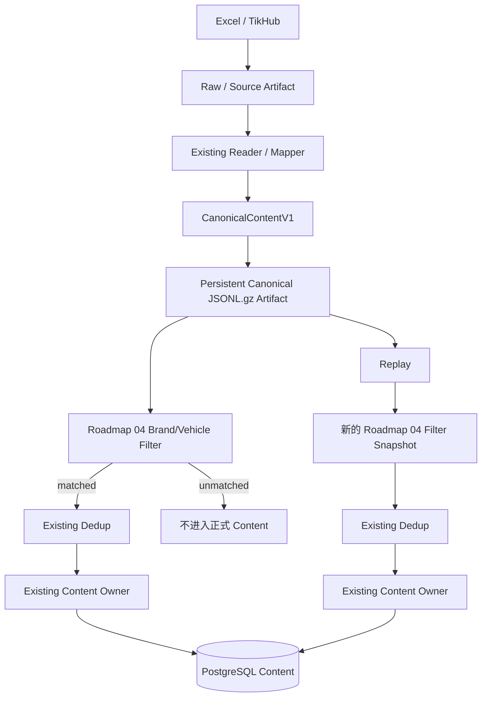
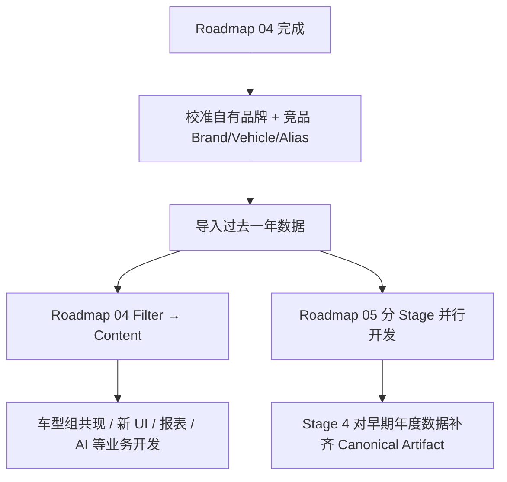
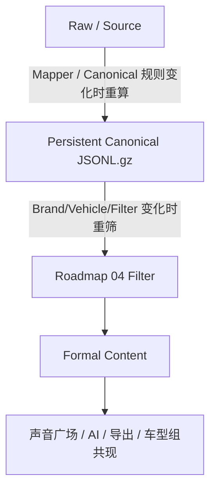

# 可重放数据底座与监测重分类实施路线

- 状态：Active
- 目标：在 [`docs/roadmap/04_搜索与品牌车型过滤实施路线.md`](04_搜索与品牌车型过滤实施路线.md) 全部完成后，**不重构现有业务主链，只在 Mapper 与 Roadmap 04 Brand/Vehicle Filter 之间增加一层可长期复用的 Canonical JSONL.gz Artifact，并提供从该 Artifact 重新执行 Roadmap 04 Filter → Dedup → Content Owner 的正式 Replay 能力**。这样以后新增/扩展 Brand、Vehicle、Alias 或调整确定性 Resolver 时，可以直接重筛已经成功归一化的数据，不需要重新上传 Excel，也不需要对已有 TikHub Raw 再次付费请求 Provider。
- 退出条件：Excel 单文件 Import、Data Import Campaign、TikHub Discovery 在成功生成 Canonical 后、进入 Roadmap 04 Filter 前，都能把成功归一化的数据持久为受 ArtifactService/ArtifactStore 管理的有界 JSONL.gz Artifact；Filter 消费该持久 Canonical；已有 Roadmap 04 前后数据可以从现有 Source/Raw/历史 Chunk 补齐可重放 Canonical；正式 Replay 能冻结现有 Roadmap 04 Filter Snapshot，按原有 Filter → Dedup → Content Owner 幂等补入新命中 Content；全链路来源、失败、容量和恢复有直接证据；长期知识同步后本 Roadmap 退出 live `docs/roadmap/`。
- 依赖：Roadmap 04 Stage 1—7 全部完成；当前 Canonical/Content Owner、ArtifactService/ArtifactStore、Data Import Campaign、Collection Provider Request/Attempt/Raw、Brand/Vehicle Catalog 与 Resolver、PostgreSQL Durable Job Runtime。完整 4000 万正式生产迁移仍受 [`docs/roadmap/03_4000万历史数据迁移实施方案.md`](03_4000万历史数据迁移实施方案.md) 的容量、生产授权和全量对账门禁约束。

本文是**已批准但尚未实现的后续 Roadmap**。当前实现仍以代码、Contract、Schema/Migration、测试和 Blueprint 为准。本文只批准一个最小增量方向：

```text
现有：
Raw / Source
→ Mapper
→ Canonical
→ Roadmap 04 Filter
→ Dedup
→ Content Owner
→ PostgreSQL

Roadmap 05：
Raw / Source
→ Mapper
→ Canonical
→ 【Persistent Canonical JSONL.gz Artifact】
→ Roadmap 04 Filter
→ Dedup
→ Content Owner
→ PostgreSQL
```

**本 Roadmap 不再建设旧版方案中的 Monitoring Membership、Current/Exited Monitoring、独立 Filter Decision History、Platform Registry、规则版本管理 UI 或新的 Research Dataset 平台。** 这些只有未来出现明确业务需求时才单独立项。

---

## 1. 为什么采用轻量版，而不是继续扩大 Roadmap 05

真正要解决的问题只有一个：

> Roadmap 04 第一次 Filter 没命中的 Canonical，未来新增车型/品牌/Alias 后，怎样不用重新取得原始数据就能再筛一次？

当前有三种可行路线。

### 方案 A：只保留 Raw，每次规则变化重新 Mapper

```text
Raw / XLSX
→ Mapper
→ Canonical
→ Filter
```

优点：几乎不增加持久数据层。

问题：每次 Brand/Vehicle Filter 变化都重复执行 Mapper；一年或 4000 万级数据会反复解析 XLSX/Provider Raw，浪费 I/O 和 CPU；而且“本次 Filter 实际消费了什么 Canonical”没有稳定持久输入。

### 方案 B：建立完整版本化数据平台

包含：

```text
Normalization Dataset
Filter Version / Decision History
Monitoring Membership
Current / Exited Monitoring
Platform Registry
独立管理 UI
```

优点：最完整。

问题：当前业务并不需要这些全部能力；会显著扩大 Schema、Contract、Frontend、Migration 和维护成本，并让 Roadmap 05 长时间阻塞实际业务开发。

### 方案 C：只增加 Persistent Canonical + Replay（本 Roadmap）

```text
Raw / Source
→ Mapper
→ Persistent Canonical JSONL.gz
→ Roadmap 04 Filter
→ Existing Content Owner
```

它保留当前架构和 Owner，只多一个稳定中间层和一个重放入口，直接解决当前真实问题。

**因此本 Roadmap 固定选择方案 C。**

---

## 2. 当前实现基础

Roadmap 05 开工时必须重新读取最新 `main`。本文只记录当前已经确认、且与目标设计有关的基础，不把示意字段当成精确机器 Contract。

### 2.1 长期数据边界已经存在

当前长期主链见 [`docs/blueprint/02_采集系统与数据标准化.md`](../blueprint/02_采集系统与数据标准化.md)：

```text
Provider / File Reader
→ Raw / Source Artifact
→ Operation / Mapper
→ Canonical
→ Decision
→ Owner
→ PostgreSQL
```

因此 Roadmap 05 不需要重新发明 Raw、Mapper、Canonical、Artifact 或 Content Owner。

### 2.2 PostgreSQL 与 ArtifactStore 已经分工

当前存储边界见 [`docs/blueprint/03_数据库与文件存储.md`](../blueprint/03_数据库与文件存储.md)：

```text
PostgreSQL
→ 业务身份、Current/History、Run/Job、Artifact metadata/关系

ArtifactStore
→ Provider Raw、Excel 输入、导出和其他大字节对象
```

所以 Persistent Canonical 的正文继续作为 Artifact 字节保存，**不为几十万/几千万条 Canonical 再建一张大宽 PostgreSQL staging 表**。

### 2.3 单文件 Excel 已经会先生成 Canonical JSONL

当前 [`backend/src/aima_ugc/bootstrap/import_worker.py`](../../backend/src/aima_ugc/bootstrap/import_worker.py) 的 Stage 3 v2 主链已经是：

```text
XLSX Artifact
→ convert_excel_to_canonical_jsonl()
→ Brand/Vehicle Filter
→ Dedup
→ Ingestion
```

但 `contents.jsonl` 目前位于 `TemporaryDirectory`，Job 结束后不会成为长期 Artifact。

因此单文件 Excel 的最小改造不是重写 Mapper，而是：

> **把已经存在的 Canonical JSONL 从临时工作文件升级为正式、可引用、可重放的 Artifact。**

### 2.4 Historical/Data Import Campaign 已经有 gzip JSONL Chunk

当前 [`backend/src/aima_ugc/adapters/providers/imports/historical_chunk.py`](../../backend/src/aima_ugc/adapters/providers/imports/historical_chunk.py) 会生成 `chunk-XXXXXXXX.jsonl.gz`；成功映射的 `candidate` 和 `filtered` 行都已经包含完整 Canonical `content`。

但当前 Chunk 同时包含：

```text
Canonical 数据
+
candidate / filtered 业务结果
```

即 Mapping 与 Roadmap 04 Filter 在同一转换阶段完成。

Roadmap 05 的目标是把新版本 Chunk 语义收敛成：

```text
Source
→ Mapper
→ Canonical Artifact
→ Filter
```

即 **Canonical Artifact 不因当次 Brand/Vehicle Filter 结果而缺失数据**。

### 2.5 TikHub 已经先保存 Raw/Candidate

Collection 当前已经先持久化 Provider Request/Attempt/Raw/Candidate，再进入 Mapper。Roadmap 04 Stage 4 会把 TikHub Discovery 收敛为 Canonical 后统一 Brand/Vehicle Filter。

Roadmap 05 只在 Roadmap 04 完成后，把“最终送入 Roadmap 04 Filter 的 Canonical”同时保存为可重放 Artifact；不改变 Provider Request/Attempt、Raw、Candidate、分页、费用和 Detail fallback 边界。

---

## 3. 固定目标架构



四个 Owner 不变：

```text
Raw / Source
→ 仍由现有 Artifact / Provider / Import 来源链负责

Mapper
→ 仍只负责外部数据 → Canonical

Roadmap 04 Filter
→ 仍负责 Brand / Vehicle 监测对象判断

Content Owner
→ 仍负责最终业务身份、Current/Version 和幂等收敛
```

Roadmap 05 只新增：

```text
Canonical Artifact Writer / Reader
+
Replay Orchestration
```

---

## 4. Roadmap 04 Filter 对自有品牌和竞品的语义不变

Roadmap 05 **不改变 Roadmap 04 Filter**。

Roadmap 04 已批准：

```text
filter_mode = all_active
→ 所有 active Brand
→ 自动包含其 active Vehicle

filter_mode = selected
→ 用户选择一个或多个 Brand
→ 自动包含所选 Brand 下 active Vehicle
```

因此 Brand `role` 不是“是否允许入库”的开关。

例如目录中存在：

```text
爱玛   role=owned
雅迪   role=competitor
九号   role=competitor
小牛   role=competitor
极核   role=competitor
```

且这些 Brand 属于本次 Filter Scope，则：

```text
只命中爱玛
→ matched → 入库

只命中雅迪
→ matched → 入库

同时命中爱玛 + 雅迪
→ matched → 入库，并允许多 Brand / Vehicle Evidence

目标 Brand / Vehicle 均未命中
→ filtered → 不进入正式 Content
```

车型组共现，例如：

```text
(爱玛元宇宙 OR 爱玛墩墩)
AND
(雅迪莱茵 OR 雅迪麦芒)
```

仍属于**入库后的 Content 查询/专题研究条件**，不是 Roadmap 05 的 Canonical 保存规则，也不是 Roadmap 04 的来源 Search 条件。

---

## 5. Persistent Canonical 的最小 Contract

### 5.1 保存什么

保存所有**成功生成合法 CanonicalContentV1 的 observation**，不先经过 Roadmap 04 Filter，也不先做业务 Dedup。

固定顺序：

```text
Mapper 成功
→ 必须进入 Canonical Artifact
→ 然后才允许 Filter / Dedup
```

因此：

```text
matched Canonical      → 保存
filtered Canonical     → 保存
重复 Canonical         → 保存（Dedup 在后面）
Mapper invalid / failed → 不伪造 Canonical；原 Raw/Source 和现有错误事实继续保留
```

### 5.2 文件格式

首版固定使用：

```text
JSONL + gzip
*.jsonl.gz
```

逻辑上：

```text
一行 = 一个 CanonicalContentV1 JSON 对象
```

精确字段不在 Roadmap 复制，以开工时当前 Canonical Contract 为唯一机器事实。

### 5.3 为什么不保存为一个巨型文件

一年或 4000 万级数据必须沿用当前有界 Chunk 思路：

```text
canonical-00000000.jsonl.gz
canonical-00000001.jsonl.gz
...
```

Chunk 大小不在本文写死；Stage 1 基于当前 Data Import/Collection 的既有有界处理机制和真实容量证据确定默认值/配置来源。

### 5.4 保存在哪里

Canonical 字节：

```text
ArtifactStore
```

PostgreSQL 只保存当前 Artifact 体系已有能力能够承载的 metadata / relation / parent identity。

**默认不新增独立 Normalization Dataset 数据库领域。** Stage 1 必须先证明现有 Artifact metadata、Import Batch/Campaign、Collection Run/Scope/Attempt 能否表达必要来源关系；只有真实缺口存在时才增加最小 Schema，不能为了“架构完整”预建一套新表。

### 5.5 必须能追溯什么

至少能够从 Canonical Artifact 追溯到其真实来源父级：

```text
Excel
→ Import Batch / Campaign Item / Source Artifact

TikHub
→ Collection Run / Scope / Provider Attempt / Raw Artifact / Candidate（按当前真实链适用）
```

具体关系字段由 Stage 1 从现有 Artifact Contract / 表结构恢复，不在 Roadmap 猜字段。

### 5.6 Retention

正式 Replay 所依赖的 Canonical Artifact 必须成为**被业务父事实引用的 Artifact**，不能被普通 orphan cleanup 当成无人引用临时文件删除。

本文不拍板“永久/5 年/10 年”等生产 Retention 数值；具体保留年限仍归生产 Retention/容量决策。

---

## 6. TikHub Canonical 的保存点

Roadmap 04 Stage 4 可能出现：

```text
Search Raw
→ Search Canonical
→ Resolver
→ unmatched 时受控 Detail
→ Detail Raw
→ Detail Canonical
→ 最终 Filter
```

Roadmap 05 首版不建立“每个中间 Canonical Observation 的版本平台”。

固定最小语义：

> **保存该 Candidate 本次实际送入最终 Roadmap 04 Brand/Vehicle Filter 的 Canonical。**

因此：

```text
Search 信息已经用于最终判定
→ 保存 Search-derived final Canonical

触发 Detail 后再用于最终判定
→ 保存 Detail-derived final Canonical
```

Raw Search/Detail 仍由现有 Provider Artifact 链保留。

限制：如果过去某条 Candidate 从未抓过 Detail，则 Replay 只能使用当时已经观察并成功 Canonical 化的字段；Persistent Canonical 不会凭空产生 Provider 当时未获取的数据。

---

## 7. Roadmap 04 完成后的年度数据操作

Roadmap 05 不要求业务等待它全部完成。

允许：



### 7.1 年度导入前

建议把实际需要研究的自有品牌和竞品配置为 active，并根据业务范围使用 Roadmap 04 的 `all_active` 或 `selected` Brand Scope。

先用小规模真实数据抽样验证 Alias，避免过宽 Alias 造成大量误入库。

### 7.2 Roadmap 05 完成前已经导入的数据

不能因为当时还没有 Pure Persistent Canonical 就要求用户重新取得数据。

Stage 4 必须提供 Backfill：

```text
单文件 Excel
→ 从已保存 Input Artifact 重新 Mapper
→ Canonical Artifact

Historical/Data Import Campaign
→ 优先复用现有 Chunk 中已经保存的合法 Canonical content；
→ 若旧 Chunk 无法安全提升，再从 Source Artifact 重新 Mapper

TikHub
→ 从已保存 Raw Artifact / Candidate 调用现有 Mapper
→ Canonical Artifact
```

上述 Backfill：

- 不要求重新上传仍存在 Source Artifact 的 Excel；
- 不对已有完整 Raw 重新调用 TikHub；
- 不自动触发 AI；
- 不因为补 Canonical Artifact 改写现有 Content Current。

---

## 8. Replay 的固定语义

Replay 不是新的第二套 Ingestion。

必须复用：

```text
Canonical Artifact Reader
→ 当前 Roadmap 04 Brand/Vehicle Resolver / Filter
→ Existing Dedup
→ Existing Content Owner
```

### 8.1 Replay 输入

至少：

```text
一个或多个 Canonical Artifact
+
任务创建时冻结的 Roadmap 04 BrandVehicleFilterSnapshot
```

不建立第二套 Filter Version 表；直接复用 Roadmap 04 已经存在的冻结 Snapshot Contract。

### 8.2 Replay 输出

最小统计：

```text
rows_seen
rows_matched
rows_filtered_out
duplicates_removed
rows_ingested / existing convergence
invalid_artifact_rows（如适用）
```

精确命名开工时与现有 Job/Batch stats 对齐，不为 Roadmap 新造第二套同义字段。

### 8.3 幂等

同一 Canonical Artifact 使用同一/等价 Filter 重跑：

```text
不得生成重复 Content
不得绕过现有 Content identity
不得绕过 Content Owner
```

已经存在的 Content 按当前正式 ingestion policy / Owner 语义收敛。

### 8.4 本轻量版故意不做“退出监测”

Replay 主要服务：

```text
新增 Brand
新增 Vehicle
新增 Alias
扩大 selected Brand Scope
Resolver 增强后补入新命中数据
```

如果新规则比旧规则更窄：

```text
以前 accepted
现在 filtered
```

**本 Roadmap 不自动删除、隐藏或标记退出已有 Content。**

原因：要正确支持“当前监测 vs 历史监测”就需要 Monitoring Membership/Decision History，这正是本轮明确不做的复杂度。

未来如果业务明确需要缩小监测范围并让声音广场默认移除旧 Content，再单独建立相应 Requirement/Roadmap，不在本 Roadmap 预付机制。

---

## 9. Roadmap 05 分 Stage 实施

每个 Stage 都是独立施工单元；从当时最新 `main` 开始，完成、验证、PR、merge 后再进入下一 Stage。中间 `main` 必须继续支持 Roadmap 04 已有业务和并行的新 UI/专题功能。

| Stage | 当前状态 | 依赖 | 核心结果 |
| --- | --- | --- | --- |
| Stage 1 Canonical Artifact 基础 | blocked | Roadmap 04 全部完成 | 共用 JSONL.gz Writer/Reader + Artifact/lineage 最小 Contract |
| Stage 2 Excel 持久 Canonical | blocked | Stage 1 | 单文件 + Historical/Data Import 在 Filter 前持久 Canonical |
| Stage 3 TikHub 持久 Canonical | blocked | Stage 1 + Roadmap 04 完成态 | Discovery 最终 Filter 输入 Canonical 持久化 |
| Stage 4 Replay 与历史补齐 | blocked | Stage 2 + Stage 3 | 旧/新 Canonical Artifact 可重跑 Roadmap 04 Filter 并幂等入库 |

`blocked` 表示 Roadmap 前置尚未满足，不表示当前生产代码故障。

---

# Stage 1：Canonical Artifact 基础

## 目标

建立最小共用的 Persistent Canonical Writer/Reader 和 Artifact 关系语义，不切换任何现有 Runtime。

## 必须完成

1. 定义统一 `*.jsonl.gz` Artifact 格式，一行一个当前合法 `CanonicalContentV1`；
2. Writer 流式写入，不能把整个 Dataset 一次加载到内存；
3. Reader 流式读取，并用当前 Canonical Contract 做 fail-closed 校验；
4. gzip 输出满足当前项目可复现/完整性习惯；
5. 每个 Artifact 有 SHA-256/byte size 等现有完整性事实；
6. 能绑定真实来源父级；
7. Canonical Artifact 必须受正式 Artifact 生命周期管理；
8. 先复用现有 Artifact metadata/link 体系；真实缺口存在时才增加最小 Schema/Migration；
9. 不新增 Monitoring Membership、Filter History、Platform Registry、第二数据库或新消息系统。

## 直接验证

至少证明：

```text
多个 Canonical
→ Writer
→ ArtifactStore
→ Reader
→ 与输入 Canonical 语义等价
```

并覆盖：

- 中文/Unicode；
- 大文本；
- 空可选字段；
- 损坏 gzip；
- 非法 JSON；
- 不符合当前 Canonical Contract 的行；
- Artifact 完整性；
- 有界内存处理。

## Main-safe

Stage 1 合并后现有 Excel/TikHub/Voice Plaza 行为不变；只是增加可复用基础能力。

---

# Stage 2：Excel 在 Filter 前持久 Canonical

## 目标

把两个正式 Excel 入口都调整为：

```text
Mapper
→ Persistent Canonical Artifact
→ Roadmap 04 Filter
→ Dedup
→ Existing Content Owner
```

## A. 单文件 Import

以当前 [`backend/src/aima_ugc/bootstrap/import_worker.py`](../../backend/src/aima_ugc/bootstrap/import_worker.py) 为事实入口。

当前已经有临时 `contents.jsonl`；改造重点：

1. Mapping 完成后把全部合法 Canonical 写成正式 JSONL.gz Artifact；
2. Artifact 成功 `stored/linked` 后，Filter 才进入业务判断；
3. Filter 从该持久 Canonical Artifact（或经完整性校验的同一 Artifact 本地副本）读取；
4. 后续 Dedup / `ingest_unified_content_batch()` 继续复用，不复制写库逻辑；
5. 原 Input XLSX Artifact 继续保留来源事实；
6. Job 重试不得因为已有完整 Canonical Artifact 再制造不同的平行 Canonical 副本；恢复/接管语义需在 Stage 内明确并验证。

## B. Historical/Data Import Campaign

以当前 [`backend/src/aima_ugc/adapters/providers/imports/historical_chunk.py`](../../backend/src/aima_ugc/adapters/providers/imports/historical_chunk.py) 与 [`backend/src/aima_ugc/bootstrap/historical_import_worker.py`](../../backend/src/aima_ugc/bootstrap/historical_import_worker.py) 为事实入口。

新版本链：

```text
Source XLSX Artifact
→ Reader / Mapper
→ Pure Canonical Chunk Artifact
→ Import Chunk Worker
→ Roadmap 04 Filter
→ Existing row outcome / Dedup / Content Owner
```

要求：

- 新 Canonical Chunk 不用 `candidate/filtered` 决定是否写入 Canonical；
- 成功 Mapper 的 Canonical 全部保存；
- `invalid` 继续通过现有来源/逐行结果账本表达，不伪造 Canonical；
- Filter 决策移动到消费 Canonical Chunk 的业务阶段；
- 已存在旧 Chunk schema / queued/running Job 必须有明确兼容窗口，不能被新 Worker 错读；
- 原有 `historical_fill_only` / `standard_observation` 语义不改变。

## 退出条件

- 两个 Excel 正式入口都能证明 `Mapper success count == Canonical Artifact row count`（按适用 invalid 语义对账）；
- matched + filtered Canonical 均存在 Artifact；
- Filter/Dedup/Ingestion 结果与改造前相同；
- 重试/取消/接管不产生重复 Content 或失联 Artifact；
- 现有来源链和逐行账本仍可追溯。

---

# Stage 3：TikHub 在 Filter 前持久 Canonical

## 目标

在 Roadmap 04 已完成的 TikHub Discovery 主链中加入同一 Persistent Canonical Artifact 能力。

目标链：

```text
Provider Request / Attempt
→ Raw Artifact
→ Candidate
→ Mapper
→ 必要时 Roadmap 04 Detail fallback
→ Final Canonical for Filter
→ Persistent Canonical JSONL.gz Artifact
→ Roadmap 04 Filter
→ Existing Ingestion
```

## 必须完成

1. 不改变 Provider Request/Attempt、计费、重试和 Raw Artifact 语义；
2. 不改变 Candidate 在 Mapper 前建立的边界；
3. 不改变 Roadmap 04 Search→Detail fallback 判断；
4. 把每条最终实际用于 Filter 的合法 Canonical 送入共用 Writer；
5. 按当前 Collection 的真实执行父级形成有界 Artifact，不建立第二套 Collection Run；
6. Filter 消费 Persistent Canonical；
7. filtered Canonical 仍留在 Artifact 中；
8. Mapper 失败仍由 Raw/Candidate/error ledger 追溯，不伪造 Canonical；
9. `tikhub_test` 如需使用该能力，只能复用正式 Writer/Mapper，不复制一套实现。

## 退出条件

至少覆盖：

```text
Search match
Search miss → Detail match
Search miss → Detail miss → filtered
多 Brand / 多 Vehicle
重复 Content identity
Worker retry/recovery
```

并证明新 Artifact 层没有增加真实 Provider 请求次数。

---

# Stage 4：Replay 与 Roadmap 05 前历史数据补齐

## 目标

让已有 Canonical Artifact 成为正式可重放输入，并把 Roadmap 04 完成后、Roadmap 05 完成前已经导入/采集的数据补齐到该结构。

## 4.1 Replay Job

优先复用 PostgreSQL Durable Job Runtime；不在 API 请求中同步扫描大型 Artifact。

固定处理链：

```text
选择 Canonical Artifact(s)
→ 创建 Replay 父事实 / Job（复用最接近的现有 Owner；开工时恢复）
→ 冻结当前 Roadmap 04 BrandVehicleFilterSnapshot
→ 流式读取 Canonical JSONL.gz
→ Roadmap 04 Resolver / Filter
→ Existing Dedup
→ Existing Content Owner
→ 统计与 Job 终态
```

如果现有 Import/Collection 父事实已经足以承载 Replay，不为形式新增新的 Domain/Table；如果无法表达独立 Job 的输入、状态和结果，再增加最小持久父事实。

## 4.2 历史 Backfill

### 单文件 Excel

```text
已有 Input XLSX Artifact
→ Existing Mapper
→ Persistent Canonical Artifact
```

### Historical/Data Import Campaign

优先：

```text
已有历史 Chunk 中合法 content
→ Validate Canonical
→ Pure Canonical Artifact
```

只有旧 Chunk 无法安全恢复完整合法 Canonical 时：

```text
Source XLSX Artifact
→ Existing Mapper
→ Canonical Artifact
```

### TikHub

```text
已有 Raw Artifact / Candidate
→ Existing Mapper
→ Canonical Artifact
```

已有完整 Raw 时不得为了 Backfill 再发送真实 Provider 请求。

## 4.3 Replay 不修改旧历史事实

Backfill/Persistent Canonical 是新增恢复能力：

- 不重写旧 Source/Raw Artifact；
- 不删除旧 Import/Collection 账本；
- 不修改旧 Content Version 以伪装“当年就存在 Canonical Artifact”；
- 新 Artifact 与 Backfill Job 自己留下真实创建时间和来源关系。

## 4.4 用户操作

Roadmap 05 首版必须至少有一个正式可操作入口来启动 Replay 并查看进度/结果；可以是当前产品已有运行中心中的最小扩展或正式 API，不要求为了本 Roadmap 单独设计复杂新页面。

精确 UI/API 形态在 Stage 4 开工时依据当时真实 Contract/Figma/前端边界决定。

## 退出条件

- 旧年度 Excel/TikHub 数据无需重新取得来源即可补齐 Canonical Artifact；
- 新增一个 Brand/Vehicle/Alias 后，可从旧 Canonical Artifact Replay 并把新命中 Content 幂等补入数据库；
- 重跑相同 Replay 不产生重复 Content；
- filtered 数据继续保留在 Canonical Artifact；
- Replay 可取消、重试、恢复并有明确统计；
- 不自动删除因新 Filter 不再命中的既有 Content。

---

## 10. 与并行业务开发的边界

Roadmap 05 每个 Stage 都必须 **Main-safe**。

Roadmap 04 完成以后，可以同时开发：

```text
车型组共现
新 UI / Dashboard
报表
评论补采
AI / 竞品专题分析
```

这些业务只消费正式 Content/Brand/Vehicle/Analysis 等公共事实，不直接读取 Canonical Artifact 内部格式。

建议 Git 方式：

```text
latest main
→ feature/业务功能
→ PR → main

latest main
→ r05-stage-N
→ PR → main
```

不要维护一个数周/月不合并的 Roadmap 05 大分支。

如果某个 Stage 无法做到合并后现有业务仍正常，则必须继续拆小 Stage，而不是让 `main` 长期处于半迁移状态。

---

## 11. 与车型组共现的关系

Roadmap 05 **不是车型组共现功能本身**。

数据链是：

```text
Excel / TikHub
→ Persistent Canonical
→ Roadmap 04 Filter
→ Formal Content
→ 车型组共现业务 Query
```

例如：

```text
Group A = 爱玛元宇宙 OR 爱玛墩墩
Group B = 雅迪莱茵 OR 雅迪麦芒

Query = EXISTS(Group A) AND EXISTS(Group B)
```

该功能可以在 Roadmap 04 完成后立即基于 Content Brand/Vehicle Evidence 独立开发，不需要等待 Roadmap 05。

Roadmap 05 的价值是：未来新增“爱玛露娜”等车型后，可以先 Replay 历史 Canonical，把新命中的 Content 补入正式库，然后现有车型组共现 UI/Query 自然查询到新增 Content，无需理解 Raw/Canonical 内部实现。

---

## 12. 与 4000 万历史迁移的关系

业务急需的一年数据允许：

```text
Roadmap 04 完成
→ 先导入一年
→ 先做业务
→ Roadmap 05 Stage 4 Backfill Canonical
```

完整 4000 万正式生产 Campaign 更推荐：

```text
Roadmap 04
→ Roadmap 05 Stage 1—4
→ 真实目标服务器容量验证
→ 正式 4000 万
```

原因只剩一个简单事实：

> Roadmap 05 完成后，新 4000 万数据在第一次 Mapper 时就直接留下 Persistent Canonical，不需要随后再对 4000 万做一次 Backfill。

容量门禁还必须覆盖新增的 gzip/Artifact I/O 与磁盘增长，具体由 Roadmap 03 管理。

---

## 13. 明确非目标与轻量版限制

本 Roadmap 明确不做：

- Monitoring Membership；
- `monitored / exited` 当前监测状态机；
- 全量 Filter Decision History；
- 独立 Filter Version 管理表/UI；
- Platform Registry；
- 解除当前五平台机器 Contract；
- Research Dataset 平台；
- 通用 Boolean Query AST；
- 新数据库、Kafka、Redis 或第二套 Job Runtime；
- 把全部 Canonical Payload 塞 PostgreSQL；
- 因 Filter 缩小而自动删除/隐藏历史 Content；
- 为了 Backfill 对已有完整 TikHub Raw 再调用 Provider。

如果未来真的出现这些需求，必须从当时最新事实重新设计，不能把旧版 Roadmap 05 已删除的方案当成已批准 backlog。

---

## 14. 完成后的最终效果

Roadmap 05 完成后，系统仍然保持简单的三层数据心智：



### Raw / Source

回答：

> 外部当时到底给了什么？

用于未来 Mapper/Canonical 规则变化时重新归一化。

### Persistent Canonical

回答：

> AIMA 当时已经成功统一理解成什么？

用于 Brand/Vehicle/Alias/Resolver/Filter 变化时重新筛选。

### Content

回答：

> 当前正式业务库里有哪些已经被 Monitoring Filter 接受的内容？

用于声音广场、AI、导出、报表和专题研究。

因此常见未来变化：

| 变化 | 从哪里开始 | 是否重新上传 Excel | 是否重新调用已有 TikHub Raw 对应请求 |
| --- | --- | ---: | ---: |
| 新增 Brand | Canonical Artifact | 否 | 否 |
| 新增 Vehicle | Canonical Artifact | 否 | 否 |
| 新增 Alias | Canonical Artifact | 否 | 否 |
| 扩大 Brand Scope | Canonical Artifact | 否 | 否 |
| Resolver 确定性规则调整 | Canonical Artifact | 否 | 否 |
| 新车型组共现条件 | Content | 否 | 否 |
| Mapper Bug | Raw / Source | 否（Source Artifact 仍在时） | 否（Raw 已在时） |
| Canonical Contract 需要重新解释 | Raw / Source 或可兼容旧 Canonical | 否（Source Artifact 仍在时） | 否（Raw 已在时） |
| 过去从未抓取过的 Provider Detail | 现有数据无法凭空恢复 | 不适用 | 可能需要新的 Provider 请求 |

---

## 15. 每个 Stage 的施工规则

每个 Stage 开工时必须：

1. 重新读取本 Roadmap、Roadmap 04 完成态和最新 `main`；
2. 重新读取 [`AGENTS.md`](../../AGENTS.md)、[`docs/blueprint/02_采集系统与数据标准化.md`](../blueprint/02_采集系统与数据标准化.md)、[`docs/blueprint/03_数据库与文件存储.md`](../blueprint/03_数据库与文件存储.md)、[`docs/blueprint/07_技术决策与实施门禁.md`](../blueprint/07_技术决策与实施门禁.md) 及当前 Stage 的真实代码/Contract/Schema/Migration/测试；
3. 创建/复用本 Stage 所需的 Issue/Change/PR；实际触及 Schema/公共 Contract/持久数据语义时按 L3 处理；
4. 只实现当前 Stage，不提前实现后续 Stage；
5. 保持 Roadmap 04 Filter、Content identity、Content Owner、Provider Raw/Attempt 语义不变，除非当前 Stage 明确要求并已有上游批准；
6. 复用现有生产能力，不让 `imports_test`/`tikhub_test` 复制核心逻辑；
7. 根据真实风险执行 Unit/Contract/PostgreSQL/Artifact/Job/Full-stack 等相称验证；
8. 当前 Stage merge 后重新读取 `main` 和本 Roadmap，再更新 Stage 状态；
9. Roadmap 05 全部完成前，不把未来 Stage 能力写成当前 Product/Blueprint 事实。

后续可以直接给 GPT/Codex：

```text
实施 docs/roadmap/05_可重放数据底座与监测重分类实施路线.md 的 Stage N，完成后合并到 main。

要求：
- 以当前最新 main、Roadmap 05 当前 Stage、Roadmap 04 完成态和真实代码为 Requirement Source；
- 只实现当前 Stage；
- 采用现有 Raw/Source → Mapper → Canonical → Roadmap 04 Filter → Dedup → Content Owner 主链；
- 不引入 Roadmap 05 明确列为非目标的 Monitoring Membership、Filter History、Platform Registry 等复杂度；
- 新 Canonical Artifact 必须位于 Filter/Dedup 之前并保留全部成功归一化 observation；
- 完成相称测试、Review、CI、PR、merge 与合并后验证后停止。
```

---

## 16. Roadmap 总退出条件

Stage 1—4 全部完成后，至少重新验证：

1. 单文件 Excel：Source → Mapper → Persistent Canonical → Roadmap 04 Filter → Dedup → Content；
2. Historical/Data Import Campaign：Source → Pure Canonical Chunk → Filter → existing policy/row ledger → Content；
3. TikHub：Raw/Candidate → Mapper/(Detail fallback) → Persistent Canonical → Filter → Content；
4. filtered/重复但合法的 Canonical 没有因为当前业务决策从 Artifact 中丢失；
5. Mapper invalid 不被伪造成 Canonical，仍能回到 Raw/Source/错误事实；
6. 新增 Brand/Vehicle/Alias 后，旧 Canonical Replay 能补入新命中 Content；
7. Replay 相同输入幂等，不产生重复 Content；
8. Roadmap 05 前年度数据可以从既有 Source/Raw/历史 Chunk 补齐 Canonical；
9. Replay 不重新调用已有完整 TikHub Raw 对应 Provider 请求；
10. Artifact 完整性、重试、取消、恢复、清理和容量行为有直接证据；
11. Voice Plaza/Analysis/Export/车型组共现等既有消费者不需要理解 Canonical Artifact 内部格式；
12. 长期有效的新数据流同步到 Product/Blueprint/Appendix/Operations/模块 README 中真正承担该事实的文档。

满足后，本 Roadmap 从 live `docs/roadmap/` 退出；历史施工与验收证据继续由 Change/Git 承担。
